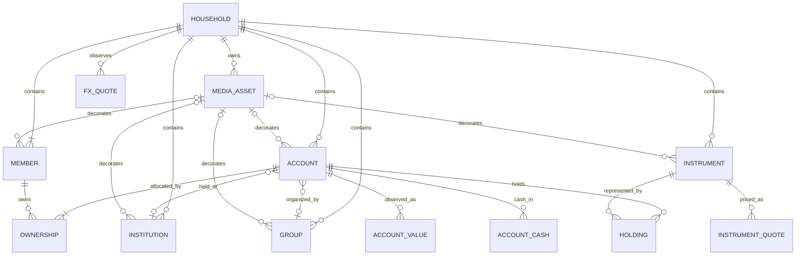

# Domain Model

## Model Boundary

This document is the canonical definition of Nestworth business concepts and financial semantics. Physical columns and Tauri DTOs are implementation details described in [data and IPC contracts](data-and-ipc-contracts.md).



## Core Entities

### Household

A Household is the single root balance sheet. It has a name and one base currency. The database and domain reject a second Household. A one-person Household is valid.

The Household base currency is immutable after onboarding. Account default currencies, cash balances, and Instrument quote currencies may differ from that base. Conversion to base currency requires an explicit FX quote except when the native currency already equals the base.

### Member

A Member represents a person used in Ownership and allocation views. A Household must retain at least one active Member. Archiving a Member does not remove or rewrite existing Ownership.

### Institution

An Institution identifies where an Account is held, such as a bank, broker, wallet provider, or lender. It is optional and organizational; it does not own the Account or determine its currency.

### Group

A Group is an optional Household-defined classification such as Emergency Fund, Retirement, or a geography. It is independent from Member, Institution, and financial Category. Groups support a built-in icon key, `#RRGGBB` color, and an optional custom logo.

### Account

An Account is the unit shown in the balance sheet. It has one primary and secondary Category, one immutable TrackingMode after creation, one default currency, exact Ownership, optional Institution and Group references, inclusion flags, lifecycle dates, and, for Balance and Manual Value modes, an append-only sequence of Account Values.

An Account can represent a bank balance, wallet, investment account valued manually, property, receivable, or liability. A Holdings-tracked Investment Account contains Holdings and cash-by-currency observations instead of an initial Account Value. An Account is not itself an Instrument.

### Ownership

Ownership relates one Account to one or more Members. It is stored in integer basis points and is used for member allocation. An Account with more than one owner is Shared; an Account with exactly one owner appears in that Member's sole-owned view.

### Account Value

An Account Value is an immutable observation, not a mutable balance column. Balance and Manual Value creation writes an initial observation, and each later update appends another. Holdings Accounts do not write an Account Value. The latest Account Value is used only for Balance and Manual Value modes.

### Instrument

An Instrument describes what a Holding represents. It belongs to one Household and has a name, type, quote currency, quote preference (Manual or Provider), optional symbol, market code, country code, ISIN, provider identity, logo, and note.

Instrument reuse is Household-scoped. Symbol alone is not unique. When both provider key and provider symbol are present, that pair is unique among the Household's non-null provider identities. Manual Instruments need no symbol or provider metadata.

### Holding

A Holding belongs to one Holdings Account and references one Instrument in the same Household. It has a current Quantity, optional note, and archive state. The same active Instrument appears at most once in one Account. Quantity edits replace current state and do not create Activities. Zero quantity is valid; negative and short quantities are rejected. Ownership is inherited from the Account.

### Account Cash Value

Cash inside a Holdings Account is an append-only observation per Account and currency. An Account may have multiple cash currencies. Zero is valid. Negative cash and margin are not modeled.

### Instrument Quote and FX Quote

Instrument Quotes and FX Quotes are append-only observations with source kind, source key, delayed flag, quote time, and creation time. Refresh appends a new observation and never rewrites history. Quote preference is stored per Instrument and per unordered FX pair.

### Media Asset

A MediaAsset is Household-scoped binary image data referenced by Members, Institutions, Groups, Accounts, or Instruments. Local PNG, JPEG, or WebP files are imported through a native dialog, normalized to a bounded PNG, and displayed as data URLs. Clearing an existing avatar or logo is not part of this release.

## Identity, Money, and Time

### Identifiers

HouseholdId, MemberId, InstitutionId, AccountGroupId, AccountId, AccountValueId, MediaAssetId, InstrumentId, HoldingId, AccountCashValueId, InstrumentQuoteId, and FxQuoteId are distinct Rust types backed by UUID v7. IDs are lowercase hyphenated UUID strings at persistence and IPC boundaries. IDs from different entity types are not interchangeable. A provider symbol is metadata, never a Nestworth business ID.

### Currency

A CurrencyCode is exactly three uppercase ASCII letters. CNY, SGD, and USD are common onboarding choices, but any syntactically valid code is accepted. A syntactically valid code does not imply that an exchange-rate provider supports it.

### Money

Money consists of a non-negative `rust_decimal::Decimal` and a CurrencyCode. Binary floating-point is forbidden for persisted values, IPC amounts, ownership, FX, quantities, or financial calculations.

Accepted Money input has:

- One to twelve integer digits
- No leading zero unless the integer part is exactly `0`
- An optional fractional part of one to four digits
- No sign, whitespace, grouping separator, or exponent
- A maximum value of `999999999999.9999`

Additional decimal types:

| Type | Integer digits | Fractional digits | Extra rule |
| --- | --- | --- | --- |
| Quantity | Up to 18 | Up to 8 | Zero allowed |
| UnitPrice | Up to 12 | Up to 8 | Zero allowed and distinct from a missing quote |
| FxRate | Up to 8 | Up to 12 | Must be greater than zero |

Canonical output removes insignificant trailing zeros: `1.2300` becomes `1.23`, and `0.0000` becomes `0`. Valuation uses checked decimal operations and rounds only values that cross the Money DTO boundary to four fractional digits using midpoint-nearest-even. Overflow returns `DECIMAL_OVERFLOW`.

### Time

Authoritative timestamps are UTC RFC 3339 strings with millisecond precision and a trailing `Z`. Calendar-only fields such as `opened_on` and `closed_on` use `YYYY-MM-DD`. A closed date cannot precede an opened date.

## Categories and Tracking Modes

| Primary category | Allowed secondary categories | Allowed tracking modes |
| --- | --- | --- |
| Cash Equivalent | Cash, Bank Account, Digital Wallet, Broker Cash, Other Cash Equivalent | Balance |
| Investment | Brokerage Account, Investment Fund Account, Bank Investment Product, Insurance, Manual Investment, Other Investment | Holdings or Manual Value |
| Property | Real Estate, Vehicle, Collectible, Other Property | Manual Value |
| Receivable | Loan Receivable, Other Receivable | Manual Value |
| Liability | Credit Card, Mortgage, Auto Loan, Consumer Loan, Personal Debt, Other Liability | Balance |

New Holdings Accounts are Investment only and do not require an initial Account Value. New Balance and Manual Value Accounts still require an initial amount. TrackingMode is immutable after creation; an update may repeat the existing value but cannot change it. Existing v0.1.1 Accounts retain their mode, currency, and Account Value history.

## Ownership Rules

- Every Account has at least one owner.
- Each Member appears at most once.
- Each share is between 1 and 10,000 basis points.
- Shares must total exactly 10,000 basis points.
- Manual input is never silently normalized to 100%.
- Percentage input supports at most two decimal places and converts exactly to basis points.
- Equal split assigns remainder basis points from the first owner forward; three owners become `3334 / 3333 / 3333`.

Ownership updates and Account updates are one atomic transaction.

## Value and Net-Worth Semantics

Asset and liability values are both stored as non-negative Money. Sign is a property of Category, not persisted input. Overview, Account, and Portfolio totals come from one Rust ValuationService:

```text
assets      = sum(included non-liability base values)
liabilities = sum(included liability base values)
net worth   = assets - liabilities
```

An Account contributes nothing when it is archived or `include_in_net_worth` is false. A missing required quote excludes only the affected component, marks parent aggregates incomplete, and never substitutes zero or one. Identity conversion (native currency equals base) needs no FX quote. Direct and inverse FX against the Household base currency must produce the same rounded Money result. Multi-hop FX is not used.

The latest Account Value or Account Cash observation is selected deterministically by:

1. `effective_at` descending
2. `created_at` descending
3. ID descending

The latest Instrument Quote or FX Quote for a preference is selected by:

1. `quoted_at` descending
2. `created_at` descending
3. ID descending

Freshness of a selected provider quote is Fresh when it is at most 24 hours old, Delayed when the provider marks it delayed and it is still within 24 hours, and Stale when it is older than 24 hours. Manual quotes are labeled Manual. A missing required quote is Unavailable.

Overview breakdowns follow these definitions:

| Breakdown | Amount | Percentage denominator |
| --- | --- | --- |
| Category | Included asset amount; liabilities are excluded | Total assets |
| Member | Ownership-weighted net contribution | Ownership-weighted total assets |
| Institution | Net contribution for the bucket | Asset amount for the bucket |
| Group | Net contribution for the bucket | Asset amount for the bucket |

Portfolio allocation reports current value by native currency, country, and Instrument type. The Investments page reports current value, not return. Member allocation distributes rounding remainders deterministically and keeps each `shareBps` within `0..=10000`. Institution and Group include an unassigned bucket when applicable. The frontend formats these results but does not recalculate them.

## Lifecycle and Reference Rules

Archive is reversible and preserves identity and history. Permanent delete is not exposed.

- Archived objects are excluded from default lists and creation pickers.
- Archived Accounts are excluded from Overview, portfolio totals, and the default Account list.
- Archived Instruments and Holdings are omitted by default while retained references remain resolvable.
- An active Account continues to display and calculate an archived Member, Institution, or Group that it already references.
- Editing may retain an existing archived reference but may not add or switch to a different archived reference.
- Archiving a Member does not alter Ownership.
- Restoring one object does not restore related objects automatically.
- Archiving and restoring an already matching state is idempotent.

Foreign keys protect structural references, while application transactions enforce aggregate rules such as exact Ownership and the last-active-Member requirement.

## Deferred Domain Extensions

These concepts are intentionally deferred and are not current behavior:

- v0.1.3: Activities, balanced activity entries, transfers, trades, historical quotes, and valuation snapshots
- v0.1.4: Cost basis, realized and unrealized gain, investment income, TWR, XIRR, and attribution
- v0.1.5: Automation rules, pending activities, imports, exports, backups, and reminders

Their detailed models must be designed when their release becomes active. They must extend the current identity, Money, Ownership, lifecycle, quote, and sign semantics. v0.1.3 must not fabricate past trades from v0.1.2 quantity edits.
