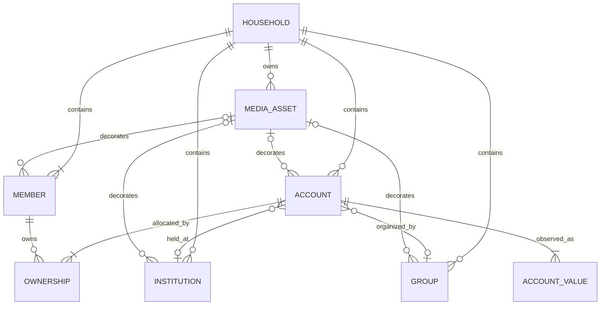

# Domain Model

## Model Boundary

This document is the canonical definition of Nestworth business concepts and financial semantics. Physical columns and Tauri DTOs are implementation details described in [data and IPC contracts](data-and-ipc-contracts.md).



## Core Entities

### Household

A Household is the single root balance sheet in v0.1.1. It has a name and one base currency. The database and domain reject a second Household. A one-person Household is valid.

All v0.1.1 Accounts and Account Values use the Household base currency. There is no active base-currency mutation surface. Multi-currency valuation is deferred to v0.1.2.

### Member

A Member represents a person used in Ownership and allocation views. A Household must retain at least one active Member. Archiving a Member does not remove or rewrite existing Ownership.

### Institution

An Institution identifies where an Account is held, such as a bank, broker, wallet provider, or lender. It is optional and organizational; it does not own the Account or determine its currency.

### Group

A Group is an optional Household-defined classification such as Emergency Fund, Retirement, or a geography. It is independent from Member, Institution, and financial Category. v0.1.1 supports a built-in icon key, `#RRGGBB` color, and an optional custom logo.

### Account

An Account is the unit shown in the balance sheet. It has one primary and secondary Category, one immutable TrackingMode after creation, one default currency, exact Ownership, optional Institution and Group references, inclusion flags, lifecycle dates, and an append-only sequence of Account Values.

An Account can represent a bank balance, wallet, investment account valued manually, property, receivable, or liability. A future investment Account can contain Holdings; an Account is not itself an Instrument.

### Ownership

Ownership relates one Account to one or more Members. It is stored in integer basis points and is used for member allocation. An Account with more than one owner is Shared; an Account with exactly one owner appears in that Member's sole-owned view.

### Account Value

An Account Value is an immutable observation, not a mutable balance column. Creation writes an initial observation, and each later update appends another. v0.1.1 exposes only the latest value but preserves earlier observations for future history.

### Media Asset

A MediaAsset is Household-scoped binary image data referenced by Members, Institutions, Groups, or Accounts. v0.1.1 imports local PNG, JPEG, or WebP files through a native dialog, normalizes them to a bounded PNG, and displays them as data URLs. Clearing an existing avatar or logo is not part of this release.

## Identity, Money, and Time

### Identifiers

HouseholdId, MemberId, InstitutionId, AccountGroupId, AccountId, AccountValueId, and MediaAssetId are distinct Rust types backed by UUID v7. IDs are lowercase hyphenated UUID strings at persistence and IPC boundaries. IDs from different entity types are not interchangeable.

### Currency

A CurrencyCode is exactly three uppercase ASCII letters. CNY, SGD, and USD are common onboarding choices, but any syntactically valid code is accepted. A syntactically valid code does not imply that an exchange-rate provider supports it.

### Money

Money consists of a non-negative `rust_decimal::Decimal` and a CurrencyCode. Binary floating-point is forbidden for persisted values, IPC amounts, ownership, FX, quantities, or financial calculations.

Accepted input has:

- One to twelve integer digits
- No leading zero unless the integer part is exactly `0`
- An optional fractional part of one to four digits
- No sign, whitespace, grouping separator, or exponent
- A maximum value of `999999999999.9999`

Canonical output removes insignificant trailing zeros: `1.2300` becomes `1.23`, and `0.0000` becomes `0`.

### Time

Authoritative timestamps are UTC RFC 3339 strings with millisecond precision and a trailing `Z`. Calendar-only fields such as `opened_on` and `closed_on` use `YYYY-MM-DD`. A closed date cannot precede an opened date.

## Categories and Tracking Modes

| Primary category | Allowed secondary categories | Required v0.1.1 tracking mode |
| --- | --- | --- |
| Cash Equivalent | Cash, Bank Account, Digital Wallet, Broker Cash, Other Cash Equivalent | Balance |
| Investment | Brokerage Account, Investment Fund Account, Bank Investment Product, Insurance, Manual Investment, Other Investment | Manual Value |
| Property | Real Estate, Vehicle, Collectible, Other Property | Manual Value |
| Receivable | Loan Receivable, Other Receivable | Manual Value |
| Liability | Credit Card, Mortgage, Auto Loan, Consumer Loan, Personal Debt, Other Liability | Balance |

The domain can parse `Holdings` for forward-compatible persisted data, but v0.1.1 does not create Holdings-tracked Accounts. New Accounts must use the policy above. Because every Account has an initial Account Value, TrackingMode is immutable after creation; an update may repeat the existing value but cannot change it.

## Ownership Rules

- Every Account has at least one owner.
- Each Member appears at most once.
- Each share is between 1 and 10,000 basis points.
- Shares must total exactly 10,000 basis points.
- Manual input is never silently normalized to 100%.
- Percentage input supports at most two decimal places and converts exactly to basis points.
- Equal split assigns remainder basis points from the first owner forward; three owners become `3334 / 3333 / 3333`.

Ownership updates and Account updates are one atomic transaction.

## Value and Net-Worth Semantics

Asset and liability values are both stored as non-negative Money. Sign is a property of Category, not persisted input:

```text
assets      = sum(latest included non-liability values)
liabilities = sum(latest included liability values)
net worth   = assets - liabilities
```

An Account contributes zero when it is archived or `include_in_net_worth` is false. A missing latest value is treated as zero for Overview, although normal creation always writes an initial value.

The latest Account Value is selected deterministically by:

1. `effective_at` descending
2. `created_at` descending
3. ID descending

Overview breakdowns follow these definitions:

| Breakdown | Amount | Percentage denominator |
| --- | --- | --- |
| Category | Included asset amount; liabilities are excluded | Total assets |
| Member | Ownership-weighted net contribution | Ownership-weighted total assets |
| Institution | Net contribution for the bucket | Asset amount for the bucket |
| Group | Net contribution for the bucket | Asset amount for the bucket |

Member allocation distributes rounding remainders deterministically and keeps each `shareBps` within `0..=10000`. Institution and Group include an unassigned bucket when applicable. The frontend formats these results but does not recalculate them.

## Lifecycle and Reference Rules

Archive is reversible and preserves identity and history. Permanent delete is not exposed in v0.1.1.

- Archived objects are excluded from default lists and creation pickers.
- Archived Accounts are excluded from Overview and the default Account list.
- An active Account continues to display and calculate an archived Member, Institution, or Group that it already references.
- Editing may retain an existing archived reference but may not add or switch to a different archived reference.
- Archiving a Member does not alter Ownership.
- Restoring one object does not restore related objects automatically.
- Archiving and restoring an already matching state is idempotent.

Foreign keys protect structural references, while application transactions enforce aggregate rules such as exact Ownership and the last-active-Member requirement.

## Deferred Domain Extensions

These concepts are intentionally deferred and are not v0.1.1 behavior:

- v0.1.2: Instruments, Holdings, account cash by currency, market quotes, FX quotes, and valuation freshness
- v0.1.3: Activities, balanced activity entries, transfers, trades, historical quotes, and valuation snapshots
- v0.1.4: Cost basis, realized and unrealized gain, investment income, TWR, XIRR, and attribution
- v0.1.5: Automation rules, pending activities, imports, exports, backups, and reminders

Their detailed models must be designed when their release becomes active. They must extend the current identity, Money, Ownership, lifecycle, and sign semantics.
