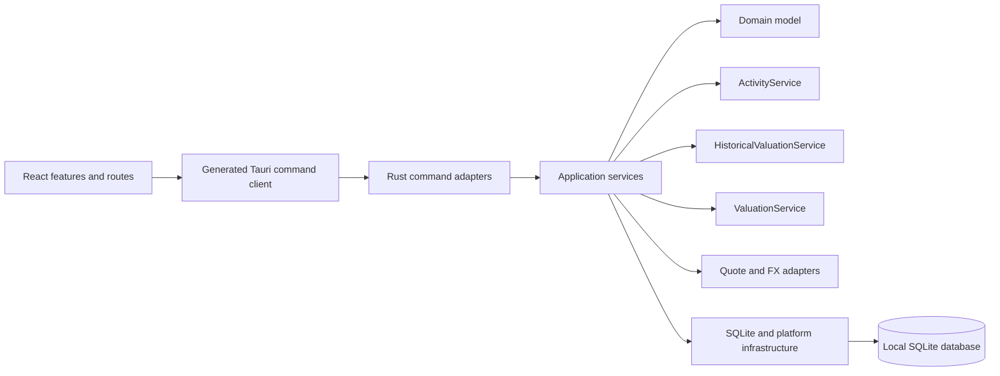
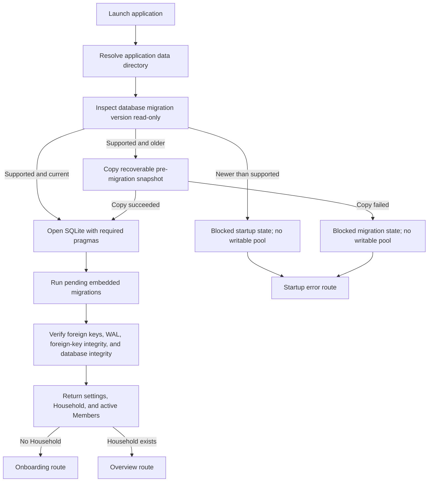

# System Overview

## Platform Contract

Nestworth is a desktop-only Tauri 2 application with these locked constraints:

- Minimum operating system: macOS 26.0
- Distribution architecture: Apple Silicon `arm64` only
- Frontend package manager and script runner: Bun
- Local SQLite database as the business-data source of truth
- No account registration or network dependency for core operation

The repository must not add an alternative npm, pnpm, or Yarn workflow. Release artifacts target `aarch64-apple-darwin` and produce `.app` and `.dmg` bundles.

## Application Layers

### Frontend

The React frontend owns presentation, interaction state, form ergonomics, routing, localization, and query caching. It calls typed Tauri commands and renders returned DTOs. It must not open SQLite, construct SQL, or recalculate authoritative financial totals. Analytics charts map returned coordinates to pixels; they do not compute a gain, a rate, an allocation, or a total.

### Command Adapters

Tauri commands expose the public desktop boundary. They accept generated DTO inputs, delegate immediately to application services, and translate application errors into the stable command error contract. Business policy does not belong in command wrappers.

### Application Services

Application services coordinate use cases, authorization to the current Household, transactions, persistence queries, domain construction, and DTO assembly. Overview and portfolio are application-level calculations because they combine several repositories under a consistent read snapshot. ValuationService is the only financial authority for current native-to-base conversion, quote selection, freshness, and completeness. ActivityService is the only authority for posting, previewing, reversing, and correcting ledger facts and their current projections. HistoricalValuationService reconstructs closed-day state from History Origin plus ordered Activities and never starts from current totals. Analytics modules (`analytics_query_service`, `cost_basis_service`, `gain_service`, `return_service`, `attribution_service`, `income_fee_service`, and `currency_decomposition`) are a read-only interpretation of that ledger; they introduce no second valuation path. Cost-basis declaration and revocation are the only analytics writes.

Quote and FX provider adapters live in application code. Production uses unconfigured adapters. Tests inject deterministic fakes. Provider calls do not run during bootstrap, migration, onboarding, ordinary reads, or analytics.

### Domain

The Rust domain owns values and invariants that must hold regardless of UI behavior: identifiers, money, signed money, quantity, unit price, FX rate, return rate, currency, category pairs, tracking modes, ownership, timestamps, account lifecycle, instruments, holdings, quotes, Activity kinds and legs, History Origin time, FIFO lot replay, and financial sign rules. It has no dependency on React, Tauri commands, or SQL rows.

### Infrastructure

Infrastructure owns the database path, connection options, migrations, integrity checks, and runtime compatibility state. It does not decide product-level validation or presentation.

## Dependency Rules

- Dependencies point inward toward the domain; domain code never imports application or infrastructure code.
- Frontend features use the generated command client rather than handwritten invoke strings.
- Only Rust opens or mutates business data.
- Financial formulas execute in Rust and cross IPC as results.
- A multi-row mutation is one application transaction.
- A summary composed from multiple collections uses one read snapshot.
- List implementations use bounded queries and must not query once per result row.
- Raw SQLx errors and sensitive local data never cross IPC.

The stable business semantics are defined in the [domain model](domain-model.md). Persistence and wire contracts are defined in [data and IPC contracts](data-and-ipc-contracts.md).

## Startup and Bootstrap

The compatibility inspection happens before a writable connection is created. An older supported database is copied to a sibling snapshot before migrations run. An unsupported future migration version produces a blocked `AppState` with zero writes to that file; all commands that require the database remain unavailable, including Activity and history commands, and bootstrap returns diagnostic migration numbers and the database path. After a supported migrate, History Origin is initialized before the runtime becomes ready.

Onboarding validates the complete request before opening its write transaction, inserts the Household and Members atomically, and updates the singleton application settings row. A Household already present is a conflict rather than a second workspace.

## Frontend Structure and State

TanStack Router defines explicit routes for startup, onboarding, overview, activity, analytics, maintenance, investments, instruments, account list and detail, institutions, groups, general settings, and member settings. Primary feature pages load through route-level code splitting. Account owner, category, institution, and group filters, plus Activity and Analytics list filters, live in URL search parameters so refresh and detail navigation preserve context. `/maintenance` is a read-before-write queue for pending Activities, recurring rules, and freshness reminders. The AppShell mounts one keyboard-accessible command palette that combines static safe actions with bounded Rust global search. `/analytics` is a read-only interpretation surface over the ledger; it posts no Activity and changes no current total.

State ownership is divided by lifetime:

| State | Owner |
| --- | --- |
| Durable business data | SQLite through Rust commands |
| Server-like command results | TanStack Query cache |
| Navigation and account filters | TanStack Router URL state |
| Form input and validation | React Hook Form and Zod |
| Short-lived interaction state | Local React state |
| Language and appearance | Application settings, with frontend providers applying them |

Mutations invalidate relevant queries after success. Financial mutations are not optimistically reflected because the Rust result is authoritative.

## Technology Decisions

| Area | Choice | Reason |
| --- | --- | --- |
| Desktop runtime | Tauri 2 | Native macOS packaging with a Rust authority boundary |
| Frontend | React 19 and TypeScript | Typed component model and mature testing ecosystem |
| Build and packages | Bun and Vite | One locked JavaScript workflow with fast local feedback |
| Styling | Tailwind CSS 4 with small local UI primitives | Consistent styling without a heavy runtime component framework |
| Routing | TanStack Router | Typed routes and durable URL search state |
| Async data | TanStack Query | Command lifecycle, cache, invalidation, and error states |
| Forms | React Hook Form and Zod | Responsive forms with explicit client validation |
| Localization | i18next and react-i18next | Runtime English and Simplified Chinese support |
| Persistence | SQLite through SQLx | Local ownership, explicit SQL, migrations, and transaction control |
| Financial decimal | rust_decimal | Decimal arithmetic without binary floating-point loss |
| IPC generation | tauri-specta and Specta | Rust-owned command and DTO types exported to TypeScript |

Dependency versions are owned by the manifests and lockfiles, not this document.

## Privacy and Security Boundaries

- The frontend has no business-data database access and no required internet connection.
- The production CSP permits self-hosted application resources, Tauri IPC, and data images; it blocks arbitrary objects, frames, and external content.
- The main window capability grants `core:default`, `dialog:allow-open`, `dialog:allow-save`, `log:allow-log`, and the window-state restore/save permissions. It does not grant filesystem, opener, shell, clipboard, HTTP, or `dialog:default`.
- Dialog, window-state, and logging plugins are initialized in Rust; plugin availability does not authorize broad frontend capabilities.
- Logs identify lifecycle and failure events but must not include balances, notes, quantities, Account names, Instrument symbols, quote values, raw legs, cost, basis, gain, proceeds, return, rate, ownership input, image bytes, database contents, or other sensitive payloads.
- User-facing errors expose stable codes and safe context, while detailed database errors remain in local diagnostics.
- Media remains Household-scoped and local. Image decoding and normalization must happen on trusted native paths before persistence.

## Evolution Rules

Later releases may add live providers, imports, or sync, but must preserve these boundaries:

- The local store remains usable when integrations fail.
- Provider implementations remain behind application interfaces.
- A centralized valuation path supplies current summaries; historical totals reconstruct forward from History Origin.
- Analytics remain a read-only interpretation of the ledger; lots and gains are not persisted.
- Historical facts are appended or explicitly corrected, not silently reinterpreted.
- Compatibility checks occur before any migration or business write.
- Origin and adjustment quantities remain unknown-basis until an explicit cost-basis declaration supplies a cost.
