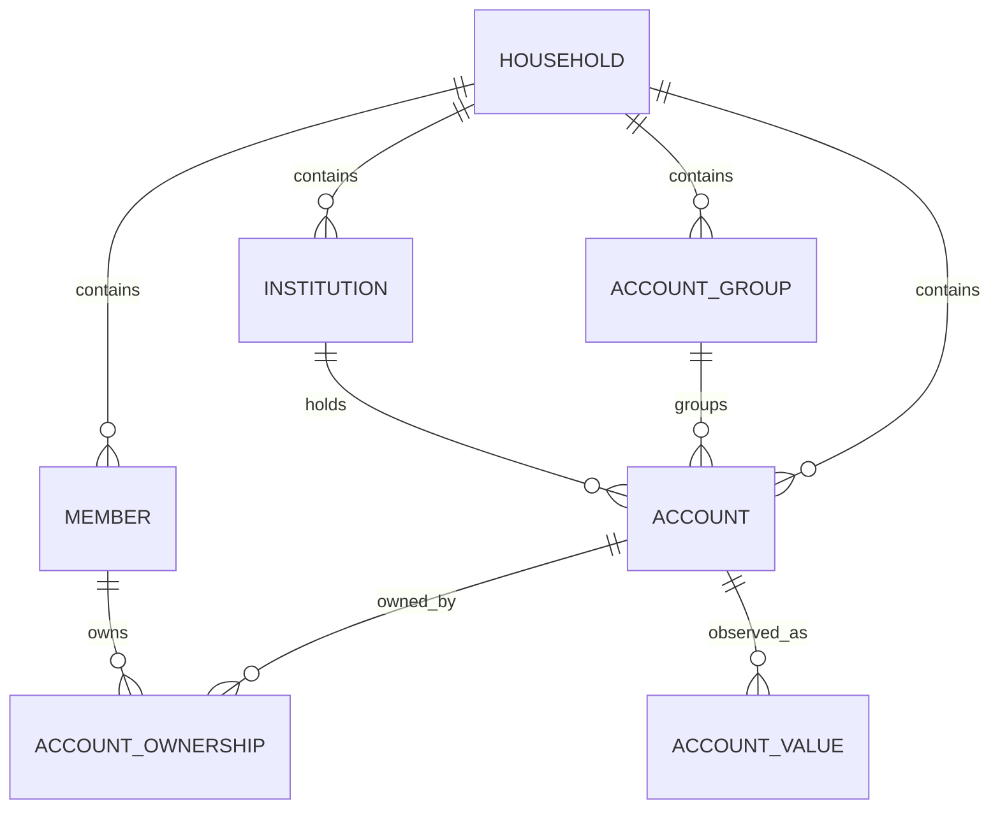

# Nestworth v0.1.1 技术设计与实现方案

> Product: **Nestworth**  
> Version: **v0.1.1**  
> Platform: **macOS**  
> Architecture: **Tauri 2 + Rust + React + TypeScript + SQLite**  
> Date: 2026-08-17

---

# 1. 摘要

Nestworth v0.1.1 是整个产品的基础版本。

本版本不追求股票行情、交易记录、收益分析等高级能力，而是首先建立稳定的：

```text
Household
Member
Institution
Group
Account
Ownership
Account Value
Net Worth
```

领域模型。

完成 v0.1.1 后，用户应该能够：

1. 创建自己的 Household。
2. 创建家庭成员。
3. 创建银行、券商、钱包等 Institution。
4. 创建自定义 Group。
5. 创建资产和负债 Account。
6. 指定 Account 所有权。
7. 输入和更新 Account 当前价值。
8. 查看整个家庭的 Assets、Liabilities 和 Net Worth。
9. 按 Member / Category / Institution / Group 查看资产。
10. Archive 不再使用的对象。
11. 使用中文或英文界面。
12. 使用 Light / Dark / System Appearance。
13. 为 Member、Institution、Group、Account 设置头像或 Logo。

本版本最重要的技术目标是：

> **建立以后 v0.1.2～v0.1.5 可以持续演进，而不需要推倒重来的数据模型和应用架构。**

---

# 2. v0.1.1 Feature Scope

## 2.1 包含

### Application

- 首次启动 Onboarding
- Main Window
- Sidebar
- Light / Dark / System Appearance
- i18n
- Window State Restore

### Household

- 创建 Household
- 修改 Household Name
- 设置 Base Currency

### Member

- Create
- Read
- Update
- Archive
- Restore
- Avatar

### Institution

- Create
- Read
- Update
- Archive
- Restore
- Logo

例如：

```text
DBS
MooMoo SG
WeChat
Alipay
OCBC
UOB
```

### Group

- Create
- Read
- Update
- Archive
- Restore
- Icon / Logo
- Color

例如：

```text
Emergency Fund
Retirement
Singapore
Baby Fund
```

### Account

- Create
- Read
- Update
- Archive
- Restore
- Current Value
- Note
- Institution
- Group
- Category
- Ownership
- Logo
- Include in Statistics

### Overview

- Assets
- Liabilities
- Net Worth
- Category Breakdown
- Member Breakdown
- Institution Breakdown
- Group Breakdown

---

# 3. 明确不包含

v0.1.1 不实现：

```text
股票 / ETF Holding
Instrument
股票行情
基金行情
Crypto
FX API
多币种换算
Transfer
Buy / Sell
Activity Ledger
历史走势图
Investment Performance
Cost Basis
TWR
XIRR
Automation
CSV Import
Backup
Cloud Sync
```

这些能力必须通过扩展当前模型实现，而不是修改当前基础模型的核心语义。

---

# 4. 技术栈

## Frontend

```text
React
TypeScript
Vite

Tailwind CSS 4
shadcn/ui
Base UI
Lucide

TanStack Router
TanStack Query

React Hook Form
Zod

i18next
react-i18next
```

React 官方目前推荐新项目使用现代 framework 或 Vite 等 build tool；Tauri 也明确适合使用编译为静态 HTML/CSS/JS 的 SPA frontend。

TanStack Router 用于强类型路由；其路由参数、导航和 Search Params 都支持 TypeScript 类型推导。

TanStack Query 用来管理：

```text
React
  ↓
Tauri IPC
  ↓
Rust
```

这条异步数据链路的 Cache / Loading / Mutation / Invalidation。Mutation 成功后通过 `invalidateQueries()` 刷新受影响的 Domain State。

---

## Backend

```text
Tauri 2

SQLx
SQLite

rust_decimal

Serde
serde_json

uuid
chrono

thiserror

tracing
tracing-subscriber

Specta
tauri-specta

image
base64
```

SQLx 当前原生支持 SQLite 和内嵌 Migration；`sqlx::migrate!()` 可以把 migrations 编译进应用。

`rust_decimal` 用于所有权威金融计算，避免使用二进制浮点处理金额。

---

# 5. 建议增加 tauri-specta

相对于之前的技术栈，我建议从 v0.1.1 就加入：

```text
specta
tauri-specta
```

作用：

```text
Rust DTO
   ↓
自动生成
   ↓
TypeScript DTO + Command Binding
```

避免维护：

```text
Rust:
CreateAccountInput

和

TypeScript:
CreateAccountInput
```

两套重复定义。

当前 `tauri-specta` 已支持从 Tauri Command 和 Rust 类型生成 TypeScript binding。

因此建议 IPC Contract：

> **Rust 是唯一类型定义 Source of Truth。**

---

# 6. 总体架构

```text
┌──────────────────────────────────────────────┐
│                  Nestworth                    │
│                                              │
│  ┌────────────────────────────────────────┐  │
│  │ React                                  │  │
│  │                                        │  │
│  │ Pages                                  │  │
│  │ Components                             │  │
│  │ Forms                                  │  │
│  │ TanStack Router                        │  │
│  │ TanStack Query                         │  │
│  └───────────────────┬────────────────────┘  │
│                      │                       │
│                Tauri IPC                    │
│                      │                       │
│  ┌───────────────────▼────────────────────┐  │
│  │ Command Layer                         │  │
│  │ DTO / Validation                      │  │
│  └───────────────────┬────────────────────┘  │
│                      │                       │
│  ┌───────────────────▼────────────────────┐  │
│  │ Application Services                  │  │
│  │                                       │  │
│  │ HouseholdService                      │  │
│  │ MemberService                         │  │
│  │ InstitutionService                    │  │
│  │ GroupService                          │  │
│  │ AccountService                        │  │
│  │ OverviewService                       │  │
│  │ MediaService                          │  │
│  └───────────────────┬────────────────────┘  │
│                      │                       │
│  ┌───────────────────▼────────────────────┐  │
│  │ Domain                                │  │
│  │                                       │  │
│  │ Household                             │  │
│  │ Account                               │  │
│  │ Ownership                             │  │
│  │ Money                                 │  │
│  │ Category                              │  │
│  └───────────────────┬────────────────────┘  │
│                      │                       │
│  ┌───────────────────▼────────────────────┐  │
│  │ Repository / SQLx                     │  │
│  └───────────────────┬────────────────────┘  │
│                      │                       │
│                   SQLite                     │
└──────────────────────────────────────────────┘
```

---

# 7. 最重要的架构约束

从 v0.1.1 开始严格遵守：

### Rule 1

Frontend 不允许访问 SQLite。

```text
React
    ↓
Tauri Command
    ↓
Rust
    ↓
SQLx
    ↓
SQLite
```

---

### Rule 2

Frontend 不计算 Net Worth。

```text
Net Worth
Assets
Liabilities
Ownership Allocation
```

全部由 Rust 计算。

---

### Rule 3

金额永远不使用：

```text
f32
f64
```

作为 Domain Value。

使用：

```rust
Decimal
```

---

### Rule 4

IPC 金额统一使用字符串。

例如：

```json
{
  "amount": "14490.00",
  "currency": "CNY"
}
```

`rust_decimal` 本身也支持通过 Serde 将 Decimal 序列化成字符串。

---

### Rule 5

Account 当前价值不直接写在：

```text
accounts.current_value
```

而使用：

```text
account_values
```

作为 append-only Observation。

这是为了 v0.1.3 历史数据做准备。

---

# 8. Repository Structure

建议项目结构：

```text
nestworth/
│
├── src/
│   │
│   ├── app/
│   │   ├── router.tsx
│   │   ├── providers.tsx
│   │   └── query-client.ts
│   │
│   ├── routes/
│   │   ├── __root.tsx
│   │   ├── index.tsx
│   │   ├── onboarding.tsx
│   │   ├── overview.tsx
│   │   ├── accounts/
│   │   ├── groups.tsx
│   │   ├── institutions.tsx
│   │   └── settings/
│   │
│   ├── features/
│   │   ├── onboarding/
│   │   ├── overview/
│   │   ├── accounts/
│   │   ├── members/
│   │   ├── institutions/
│   │   ├── groups/
│   │   ├── settings/
│   │   └── media/
│   │
│   ├── components/
│   │   ├── ui/
│   │   ├── layout/
│   │   └── common/
│   │
│   ├── lib/
│   │   ├── tauri/
│   │   ├── money/
│   │   ├── i18n/
│   │   └── utils/
│   │
│   ├── locales/
│   │   ├── en/
│   │   └── zh-CN/
│   │
│   └── bindings/
│       └── commands.ts
│
├── src-tauri/
│   │
│   ├── migrations/
│   │   └── 001_initial.sql
│   │
│   └── src/
│       │
│       ├── lib.rs
│       ├── state.rs
│       ├── error.rs
│       │
│       ├── domain/
│       │   ├── mod.rs
│       │   ├── ids.rs
│       │   ├── money.rs
│       │   ├── currency.rs
│       │   ├── household.rs
│       │   ├── member.rs
│       │   ├── institution.rs
│       │   ├── group.rs
│       │   ├── account.rs
│       │   ├── ownership.rs
│       │   └── category.rs
│       │
│       ├── application/
│       │   ├── onboarding_service.rs
│       │   ├── household_service.rs
│       │   ├── member_service.rs
│       │   ├── institution_service.rs
│       │   ├── group_service.rs
│       │   ├── account_service.rs
│       │   ├── overview_service.rs
│       │   └── media_service.rs
│       │
│       ├── infrastructure/
│       │   ├── database.rs
│       │   └── repositories/
│       │       ├── household.rs
│       │       ├── member.rs
│       │       ├── institution.rs
│       │       ├── group.rs
│       │       ├── account.rs
│       │       ├── value.rs
│       │       └── media.rs
│       │
│       └── commands/
│           ├── bootstrap.rs
│           ├── household.rs
│           ├── members.rs
│           ├── institutions.rs
│           ├── groups.rs
│           ├── accounts.rs
│           ├── overview.rs
│           ├── media.rs
│           └── settings.rs
│
└── package.json
```

---

# 9. Domain Model

v0.1.1：



---

# 10. UUID

所有业务对象：

```text
Household
Member
Institution
Group
Account
AccountValue
MediaAsset
```

使用 UUID。

建议直接使用：

```text
UUID v7
```

而不是自增 ID。

当前 `uuid` crate 也明确建议数据库主键、需要排序场景考虑 UUID v7。

Domain 中不要到处使用裸：

```rust
Uuid
```

而应：

```rust
pub struct AccountId(Uuid);
pub struct MemberId(Uuid);
pub struct HouseholdId(Uuid);
```

降低 ID 传错的风险。

IPC DTO 再转换为 String。

---

# 11. Account Category Model

## PrimaryCategory

```rust
enum PrimaryCategory {
    CashEquivalent,
    Investment,
    Property,
    Receivable,
    Liability,
}
```

数据库值：

```text
cash_equivalent
investment
property
receivable
liability
```

---

# 12. Secondary Category

建议 v0.1.1 使用：

## Cash Equivalent

```text
cash
bank_account
digital_wallet
broker_cash
other_cash_equivalent
```

## Investment

```text
brokerage_account
investment_fund_account
bank_investment_product
insurance
manual_investment
other_investment
```

这里不要使用：

```text
stock
crypto
ETF
```

作为 Account subtype。

因为：

```text
MooMoo SG
```

是 Account。

而：

```text
QQQ
BTC
NVDA
```

未来属于 Holding / Instrument。

---

## Property

```text
real_estate
vehicle
collectible
other_property
```

## Receivable

```text
loan_receivable
other_receivable
```

## Liability

```text
credit_card
mortgage
auto_loan
consumer_loan
personal_debt
other_liability
```

---

# 13. Tracking Mode

虽然 v0.1.1 只有简单资产，也要现在建立：

```rust
enum TrackingMode {
    Balance,
    ManualValue,
    Holdings,
}
```

其中：

### BALANCE

用于：

```text
Cash
Bank Account
Digital Wallet
Credit Card
Mortgage
Loan
```

### MANUAL_VALUE

用于：

```text
Property
Vehicle
Receivable
Manual Investment
```

### HOLDINGS

v0.1.1：

```text
Schema 支持
Domain 支持
UI 禁止创建
```

v0.1.2 正式启用。

---

# 14. Tracking Mode 默认规则

```text
Cash Equivalent
→ BALANCE

Liability
→ BALANCE

Investment
→ MANUAL_VALUE

Property
→ MANUAL_VALUE

Receivable
→ MANUAL_VALUE
```

v0.1.1 UI 不需要让普通用户选择 Tracking Mode。

根据 Category 自动设置。

减少表单复杂度。

---

# 15. Liability Value 语义

这是一个必须提前统一的规则。

信用卡欠：

```text
¥10,000
```

数据库保存：

```text
10000
```

而不是：

```text
-10000
```

即：

> Account Value 永远表示绝对余额。

由 Category 决定 Net Worth contribution：

```rust
match primary_category {
    Liability => -value,
    _ => value,
}
```

因此：

```text
Assets        ¥1,000,000
Liabilities    ¥200,000

Net Worth      ¥800,000
```

这样 UI 更自然，也避免用户输入负数。

---

# 16. Ownership

使用独立：

```text
account_ownership
```

而不是：

```text
accounts.member_id
```

---

## Ownership 精度

这里不需要 Decimal。

使用：

```text
basis points
```

即：

```text
10000 = 100%
5000  = 50%
3333  = 33.33%
```

字段：

```text
share_bps INTEGER
```

要求：

```text
SUM(share_bps) = 10000
```

例如：

```text
Walt     5000
Spouse   5000
```

---

# 17. Money

Domain：

```rust
pub struct Money {
    pub amount: Decimal,
    pub currency: CurrencyCode,
}
```

v0.1.1：

```text
Account Currency
==
Household Base Currency
```

这是 Service Layer 强制约束。

Schema 仍然保存：

```text
account.default_currency
account_values.currency
```

为 v0.1.2 做准备。

---

# 18. Base Currency 修改规则

v0.1.1 不支持 FX。

因此：

### Household 没有 Account

允许修改：

```text
CNY → SGD
```

### Household 已经有 Account

禁止修改 Base Currency。

返回：

```text
BASE_CURRENCY_CHANGE_NOT_ALLOWED
```

否则会把：

```text
100,000 CNY
```

错误解释成：

```text
100,000 SGD
```

v0.1.2 引入 FX 后再重新设计主币种转换。

---

# 19. SQLite Database

数据库文件：

```text
<Application Data>/Nestworth/nestworth.sqlite3
```

SQLite 是整个 v0.1.x：

> **唯一财务数据 Source of Truth。**

---

# 20. SQLite Connection

建议：

```rust
SqliteConnectOptions
    .create_if_missing(true)
    .foreign_keys(true)
    .journal_mode(SqliteJournalMode::Wal)
    .synchronous(SqliteSynchronous::Normal)
    .busy_timeout(Duration::from_secs(5))
```

SQLx 当前支持这些 SQLite Connection Options；SQLx 文档也说明 WAL 模式下 `NORMAL` 通常已经足够，而其默认 journal mode 并不会自动切换为 WAL。

SQLite 本身支持通过 `journal_mode=WAL` 设置 WAL。

Pool：

```text
max_connections = 4
```

即可。

Nestworth 不需要大型 DB Pool。

---

# 21. Migration

目录：

```text
src-tauri/migrations/

001_initial.sql
```

启动：

```rust
sqlx::migrate!("./migrations")
    .run(&pool)
    .await?;
```

SQLx 的 Migration 可以直接嵌入 Binary。

以后：

```text
001_initial.sql
002_portfolio.sql
003_activity.sql
004_analytics.sql
005_automation.sql
```

只能新增 Migration。

已经发布的 migration：

> **禁止修改。**

---

# 22. Initial Schema

建议 `001_initial.sql`：

```sql
CREATE TABLE households (
    id              TEXT PRIMARY KEY NOT NULL,
    name            TEXT NOT NULL,
    base_currency   TEXT NOT NULL CHECK(length(base_currency) = 3),

    created_at      TEXT NOT NULL,
    updated_at      TEXT NOT NULL
);


CREATE TABLE media_assets (
    id              TEXT PRIMARY KEY NOT NULL,
    household_id    TEXT NOT NULL,

    mime_type       TEXT NOT NULL,
    data            BLOB NOT NULL,

    created_at      TEXT NOT NULL,

    FOREIGN KEY(household_id)
        REFERENCES households(id)
        ON DELETE CASCADE
);


CREATE TABLE members (
    id              TEXT PRIMARY KEY NOT NULL,
    household_id    TEXT NOT NULL,

    name            TEXT NOT NULL,
    avatar_asset_id TEXT,

    note            TEXT,
    sort_order      INTEGER NOT NULL DEFAULT 0,

    created_at      TEXT NOT NULL,
    updated_at      TEXT NOT NULL,
    archived_at     TEXT,

    FOREIGN KEY(household_id)
        REFERENCES households(id)
        ON DELETE CASCADE,

    FOREIGN KEY(avatar_asset_id)
        REFERENCES media_assets(id)
        ON DELETE SET NULL
);


CREATE INDEX idx_members_household
ON members(household_id);


CREATE TABLE institutions (
    id              TEXT PRIMARY KEY NOT NULL,
    household_id    TEXT NOT NULL,

    name            TEXT NOT NULL,
    institution_type TEXT,
    country_code    TEXT,

    website         TEXT,
    note            TEXT,

    logo_asset_id   TEXT,

    sort_order      INTEGER NOT NULL DEFAULT 0,

    created_at      TEXT NOT NULL,
    updated_at      TEXT NOT NULL,
    archived_at     TEXT,

    FOREIGN KEY(household_id)
        REFERENCES households(id)
        ON DELETE CASCADE,

    FOREIGN KEY(logo_asset_id)
        REFERENCES media_assets(id)
        ON DELETE SET NULL
);


CREATE INDEX idx_institutions_household
ON institutions(household_id);


CREATE TABLE account_groups (
    id              TEXT PRIMARY KEY NOT NULL,
    household_id    TEXT NOT NULL,

    name            TEXT NOT NULL,

    icon_key        TEXT,
    color           TEXT,

    logo_asset_id   TEXT,

    description     TEXT,

    sort_order      INTEGER NOT NULL DEFAULT 0,

    created_at      TEXT NOT NULL,
    updated_at      TEXT NOT NULL,
    archived_at     TEXT,

    FOREIGN KEY(household_id)
        REFERENCES households(id)
        ON DELETE CASCADE,

    FOREIGN KEY(logo_asset_id)
        REFERENCES media_assets(id)
        ON DELETE SET NULL
);


CREATE INDEX idx_groups_household
ON account_groups(household_id);


CREATE TABLE accounts (
    id                          TEXT PRIMARY KEY NOT NULL,
    household_id                TEXT NOT NULL,

    institution_id              TEXT,
    group_id                    TEXT,

    name                        TEXT NOT NULL,

    primary_category            TEXT NOT NULL
        CHECK(primary_category IN (
            'cash_equivalent',
            'investment',
            'property',
            'receivable',
            'liability'
        )),

    secondary_category          TEXT NOT NULL,

    tracking_mode               TEXT NOT NULL
        CHECK(tracking_mode IN (
            'balance',
            'manual_value',
            'holdings'
        )),

    default_currency            TEXT NOT NULL
        CHECK(length(default_currency) = 3),

    note                        TEXT,

    logo_asset_id               TEXT,

    include_in_net_worth        INTEGER NOT NULL DEFAULT 1
        CHECK(include_in_net_worth IN (0, 1)),

    include_in_investment       INTEGER NOT NULL DEFAULT 0
        CHECK(include_in_investment IN (0, 1)),

    include_in_liquid_assets    INTEGER NOT NULL DEFAULT 0
        CHECK(include_in_liquid_assets IN (0, 1)),

    opened_on                   TEXT,
    closed_on                   TEXT,

    sort_order                  INTEGER NOT NULL DEFAULT 0,

    created_at                  TEXT NOT NULL,
    updated_at                  TEXT NOT NULL,
    archived_at                 TEXT,

    FOREIGN KEY(household_id)
        REFERENCES households(id)
        ON DELETE CASCADE,

    FOREIGN KEY(institution_id)
        REFERENCES institutions(id)
        ON DELETE SET NULL,

    FOREIGN KEY(group_id)
        REFERENCES account_groups(id)
        ON DELETE SET NULL,

    FOREIGN KEY(logo_asset_id)
        REFERENCES media_assets(id)
        ON DELETE SET NULL
);


CREATE INDEX idx_accounts_household
ON accounts(household_id);

CREATE INDEX idx_accounts_institution
ON accounts(institution_id);

CREATE INDEX idx_accounts_group
ON accounts(group_id);

CREATE INDEX idx_accounts_category
ON accounts(primary_category);


CREATE TABLE account_ownership (
    account_id      TEXT NOT NULL,
    member_id       TEXT NOT NULL,

    share_bps       INTEGER NOT NULL
        CHECK(share_bps > 0 AND share_bps <= 10000),

    PRIMARY KEY(account_id, member_id),

    FOREIGN KEY(account_id)
        REFERENCES accounts(id)
        ON DELETE CASCADE,

    FOREIGN KEY(member_id)
        REFERENCES members(id)
        ON DELETE RESTRICT
);


CREATE INDEX idx_ownership_member
ON account_ownership(member_id);


CREATE TABLE account_values (
    id              TEXT PRIMARY KEY NOT NULL,

    account_id      TEXT NOT NULL,

    value_kind      TEXT NOT NULL
        CHECK(value_kind IN (
            'balance',
            'manual_value'
        )),

    amount          TEXT NOT NULL,

    currency        TEXT NOT NULL
        CHECK(length(currency) = 3),

    effective_at    TEXT NOT NULL,
    created_at      TEXT NOT NULL,

    FOREIGN KEY(account_id)
        REFERENCES accounts(id)
        ON DELETE CASCADE
);


CREATE INDEX idx_account_values_latest
ON account_values(
    account_id,
    effective_at DESC,
    created_at DESC
);


CREATE TABLE app_settings (
    id                  INTEGER PRIMARY KEY
        CHECK(id = 1),

    language            TEXT NOT NULL DEFAULT 'system'
        CHECK(language IN (
            'system',
            'en',
            'zh-CN'
        )),

    appearance          TEXT NOT NULL DEFAULT 'system'
        CHECK(appearance IN (
            'system',
            'light',
            'dark'
        )),

    last_household_id   TEXT,

    created_at          TEXT NOT NULL,
    updated_at          TEXT NOT NULL,

    FOREIGN KEY(last_household_id)
        REFERENCES households(id)
        ON DELETE SET NULL
);
```

---

# 23. 为什么 Account Value 是独立表

不要这样：

```text
accounts.balance = 100000
```

而是：

```text
account_values

2026-08-01 → 90000
2026-08-10 → 95000
2026-08-17 → 100000
```

v0.1.1 UI 只显示：

```text
100000
```

但是底层历史已经存在。

到了 v0.1.3：

```text
Activity
Historical Net Worth
Reconciliation
```

可以直接利用这些 Observation。

---

# 24. Current Value Query

Repository 可以查询：

```sql
SELECT av.*
FROM account_values av
WHERE av.account_id = ?
ORDER BY
    av.effective_at DESC,
    av.created_at DESC,
    av.id DESC
LIMIT 1;
```

Account List 可以使用 subquery 一次加载所有 latest values。

不要：

```text
先查100个Account
再循环100次查Value
```

避免 N+1。

---

# 25. Account Update Value

每一次：

```text
Update Balance
```

都：

```sql
INSERT INTO account_values(...)
```

而不是 UPDATE。

例如：

```text
Current:
¥100,000

Update:
¥110,000
```

产生：

```text
Observation #1
100000

Observation #2
110000
```

---

# 26. Domain Validation

所有写操作都必须：

```text
Frontend Zod Validation
        ↓
Rust Domain Validation
        ↓
SQLite Constraints
```

三层保护。

Zod 只用于 UX。

真正业务合法性由 Rust 决定。

Zod 当前定位本身就是 TypeScript-first runtime schema validation。

---

# 27. Account 创建验证

创建 Account 时 Rust 必须验证：

```text
name != empty

Household exists

Institution belongs to Household

Group belongs to Household

Owners all belong to Household

Owners are unique

Ownership total == 10000

Currency == Household.baseCurrency

secondaryCategory belongs to primaryCategory

trackingMode matches category policy

initialValue >= 0
```

其中：

```text
Ownership total == 10000
```

必须在 Rust Transaction 内再次验证。

---

# 28. CreateAccount Transaction

伪代码：

```rust
async fn create_account(
    pool: &SqlitePool,
    input: CreateAccountInput,
) -> Result<Account, AppError> {

    validate_input(&input)?;

    let mut tx = pool.begin().await?;

    let household =
        household_repository::get(&mut tx, input.household_id).await?;

    validate_currency(
        &input.default_currency,
        &household.base_currency
    )?;

    validate_institution(&mut tx, &input).await?;
    validate_group(&mut tx, &input).await?;
    validate_owners(&mut tx, &input.owners).await?;

    let account = Account::new(...);

    account_repository::insert(
        &mut tx,
        &account
    ).await?;

    ownership_repository::insert_all(
        &mut tx,
        account.id,
        &input.owners
    ).await?;

    value_repository::insert(
        &mut tx,
        AccountValue::initial(...)
    ).await?;

    tx.commit().await?;

    Ok(account)
}
```

整个操作必须是：

> **Atomic Transaction**

不能出现：

```text
Account 创建成功
Ownership 创建失败
```

这种半完成状态。

---

# 29. Rust Repository 设计

v0.1.1 不建议为了“Clean Architecture”创建大量复杂 Trait。

保持简单：

```rust
pub async fn find(...)
pub async fn insert(...)
pub async fn update(...)
pub async fn archive(...)
```

Repository function 接受：

```rust
&SqlitePool
```

或者：

```rust
&mut Transaction<'_, Sqlite>
```

这样 Application Service 可以控制 Transaction 边界。

---

# 30. Application Service 职责

## HouseholdService

```text
getHousehold

updateHousehold

changeBaseCurrency
```

---

## MemberService

```text
listMembers

createMember

updateMember

archiveMember

restoreMember
```

---

## InstitutionService

```text
listInstitutions

createInstitution

updateInstitution

archiveInstitution

restoreInstitution
```

---

## GroupService

```text
listGroups

createGroup

updateGroup

archiveGroup

restoreGroup
```

---

## AccountService

核心：

```text
listAccounts

getAccount

createAccount

updateAccount

updateAccountValue

archiveAccount

restoreAccount
```

---

## OverviewService

负责：

```text
Assets

Liabilities

Net Worth

Breakdowns
```

---

## MediaService

负责：

```text
Image validation

Resize

Encode

Save

Load
```

---

# 31. Tauri App State

建议：

```rust
pub struct AppState {
    pub db: SqlitePool,
}
```

启动：

```text
create app data directory

↓

open SQLite

↓

run migration

↓

ensure app_settings

↓

Tauri manage(AppState)

↓

open frontend
```

Tauri 本身提供 Managed State，可供 Commands 获取共享状态；Tauri Command 同时支持 async function。

---

# 32. Bootstrap Command

Frontend 启动后第一条 Command：

```text
bootstrap()
```

返回：

```ts
interface BootstrapDto {
    onboardingRequired: boolean

    settings: AppSettingsDto

    household: HouseholdDto | null

    members: MemberDto[]
}
```

流程：

```text
App Launch

↓

bootstrap()

↓

onboardingRequired == true

→ /onboarding

否则

→ /overview
```

---

# 33. Onboarding

Onboarding：

```text
Step 1
Household Name

Step 2
Base Currency

Step 3
Members

Step 4
Finish
```

不要每一步保存数据库。

前端先保持临时状态。

最终：

```text
completeOnboarding()
```

一次 Transaction：

```text
Create Household

Create Member(s)

Create app_settings

Set last_household_id
```

如果用户中途退出：

```text
数据库仍然是未初始化状态
```

避免半完成 Household。

---

# 34. Onboarding Member Avatar

为了避免 Onboarding Transaction 和 Media Asset 生命周期复杂化：

v0.1.1 Onboarding：

```text
只填写 Member Name
```

完成后允许用户进入：

```text
Settings → Members
```

设置 Avatar。

这是有意的 Scope Control。

---

# 35. IPC Command Design

不要暴露：

```text
insert_account_row()
update_account_row()
select_accounts()
```

而是 Domain Command。

---

## Bootstrap

```text
bootstrap
complete_onboarding
```

## Household

```text
get_household
update_household
```

## Member

```text
list_members
create_member
update_member
archive_member
restore_member
```

## Institution

```text
list_institutions
create_institution
update_institution
archive_institution
restore_institution
```

## Group

```text
list_groups
create_group
update_group
archive_group
restore_group
```

## Account

```text
list_accounts
get_account
create_account
update_account
update_account_value
archive_account
restore_account
```

## Overview

```text
get_overview
```

## Media

```text
set_member_avatar
set_institution_logo
set_group_logo
set_account_logo

get_media
```

## Settings

```text
get_settings
update_settings
```

---

# 36. Error Contract

不要直接把：

```text
sqlx::Error
```

发送给 Frontend。

统一：

```rust
pub struct CommandError {
    pub code: ErrorCode,
    pub message: String,
    pub fields: Option<HashMap<String, String>>,
}
```

例如：

```text
VALIDATION_ERROR

NOT_FOUND

CONFLICT

OWNERSHIP_TOTAL_INVALID

BASE_CURRENCY_CHANGE_NOT_ALLOWED

INVALID_CATEGORY

INVALID_MONEY

MEDIA_INVALID

DATABASE_ERROR

INTERNAL_ERROR
```

Frontend：

```text
error.code
    ↓
i18n
    ↓
用户可读错误
```

数据库错误信息不能直接显示给用户。

---

# 37. Decimal IPC

Command DTO：

```rust
pub struct MoneyDto {
    pub amount: String,
    pub currency: String,
}
```

例如：

```json
{
  "amount": "100000.00",
  "currency": "CNY"
}
```

Frontend：

> 不允许修改成 number 后再传回 Rust。

Input：

```ts
amount: string
```

HTML：

```html
<input
  type="text"
  inputmode="decimal"
/>
```

而不是：

```html
<input type="number">
```

---

# 38. Frontend Routing

推荐：

```text
/onboarding

/overview

/accounts
/accounts/$accountId

/groups

/institutions

/settings/general
/settings/members
```

Account Filter 使用 Search Params：

```text
/accounts?owner=<memberId>

/accounts?owner=shared

/accounts?category=investment

/accounts?group=<groupId>
```

这样：

```text
Back
Forward
Refresh
```

行为自然。

---

# 39. Main App Shell

结构：

```text
┌─────────────────────────────────────────┐
│             macOS Toolbar               │
├─────────────┬───────────────────────────┤
│             │                           │
│ Sidebar     │ Main Content              │
│             │                           │
│ Overview    │                           │
│ Accounts    │                           │
│   All       │                           │
│   Walt      │                           │
│   Spouse    │                           │
│   Shared    │                           │
│             │                           │
│ Groups      │                           │
│ Institutions│                           │
│             │                           │
│ Settings    │                           │
│             │                           │
└─────────────┴───────────────────────────┘
```

Sidebar 默认宽：

```text
220–240px
```

---

# 40. Overview Page

## Header

```text
Nestworth
Wang Family
```

## Primary Card

```text
Net Worth

¥3,800,000
```

## Summary

```text
Assets
¥4,800,000

Liabilities
¥1,000,000
```

## Breakdown

v0.1.1 暂时不要引入 Recharts。

使用简单：

```text
Cash Equivalent      ¥800,000    16.7%
Investment         ¥1,200,000    25.0%
Property           ¥2,800,000    58.3%
```

加 Progress Bar 即可。

Recharts 放到 v0.1.2。

---

# 41. Net Worth Calculation

OverviewService：

```rust
for account in accounts {

    if !account.include_in_net_worth {
        continue;
    }

    let value = latest_value(account);

    match account.primary_category {
        Liability => {
            liabilities += value;
        }

        _ => {
            assets += value;
        }
    }
}

net_worth = assets - liabilities;
```

v0.1.1 所有 Account：

```text
currency == household.baseCurrency
```

所以完全不需要 FX。

---

# 42. Member Breakdown

例如：

```text
Home
¥4,000,000

Walt       50%
Spouse     50%
```

则：

```text
Walt
+¥2,000,000

Spouse
+¥2,000,000
```

Liability 同样按 Ownership 比例分配。

所有 Member Breakdown：

> 必须由 Rust OverviewService 计算。

---

# 43. Shared Account

如果：

```text
ownership.count > 1
```

则 UI 中归类：

```text
Shared
```

但 Member Net Worth 仍然按照：

```text
share_bps
```

分别计算。

---

# 44. Account List

显示：

| Account | Owner | Institution | Category | Group | Value |
|---|---|---|---|---|---|
| DBS Savings | Walt | DBS | Bank | Emergency | ¥100k |
| Home | Shared | — | Property | — | ¥4m |

v0.1.1 不需要 TanStack Table。

普通：

```text
CSS Grid / HTML Table
```

即可。

TanStack Table 等 Activity / Holding 数据量增加后再引入。

---

# 45. Account Detail

页面：

```text
DBS Savings

¥100,000

Bank Account
DBS

Owner
Walt 100%

Group
Emergency Fund

Included in Net Worth
Yes

Note
...


[ Update Balance ]

[ Edit ]

[ Archive ]
```

---

# 46. Account Create Form

建议一个 Dialog。

区域：

## Basic

```text
Name

Institution
```

## Category

```text
Primary Category

Secondary Category
```

## Ownership

```text
Walt       50%
Spouse     50%

+ Add Owner
```

React Hook Form 的 Field Array 很适合动态 Ownership Form。

## Group

```text
Group
```

Optional。

## Value

```text
Initial Value
```

Currency：

```text
CNY
```

显示但不可修改。

## Statistics

```text
Include in Net Worth

Include in Investment Portfolio

Include in Liquid Assets
```

## Note

```text
Optional
```

---

# 47. Default Statistics Rules

### Cash Equivalent

```text
Net Worth       ✓
Investment      ✗
Liquid          ✓
```

### Investment

```text
Net Worth       ✓
Investment      ✓
Liquid          ✓
```

### Property

```text
Net Worth       ✓
Investment      ✗
Liquid          ✗
```

### Receivable

```text
Net Worth       ✓
Investment      ✗
Liquid          ✗
```

### Liability

```text
Net Worth       ✓
Investment      ✗
Liquid          ✗
```

用户可以修改。

---

# 48. React Query Design

统一 Query Key。

例如：

```ts
queryKeys.household(id)

queryKeys.members(householdId)

queryKeys.institutions(householdId)

queryKeys.groups(householdId)

queryKeys.accounts(householdId, filters)

queryKeys.account(accountId)

queryKeys.overview(householdId)
```

不要在 Component 中散落：

```ts
["data"]
["accountData"]
["accounts2"]
```

---

# 49. Mutation Invalidation

例如：

```text
updateAccountValue()
```

成功后：

```text
invalidate account

invalidate accounts

invalidate overview
```

即：

```ts
queryClient.invalidateQueries({
  queryKey: queryKeys.account(id)
})

queryClient.invalidateQueries({
  queryKey: queryKeys.accountsRoot()
})

queryClient.invalidateQueries({
  queryKey: queryKeys.overview(householdId)
})
```

TanStack Query 本身就是通过 Query Invalidation 来标记数据 stale 并按需重新获取。

---

# 50. 不做 Optimistic Financial Updates

对于：

```text
Balance
Account Value
Ownership
Net Worth
```

v0.1.1：

> **不要 Optimistic Update。**

流程：

```text
User Submit

↓

Rust Transaction

↓

SQLite Commit

↓

Command Success

↓

Invalidate Query

↓

Reload authoritative state
```

宁可晚几十毫秒显示，也不要：

```text
Frontend 已显示 ¥120,000
数据库其实保存失败
```

---

# 51. Frontend State

v0.1.1 不引入 Zustand。

使用：

### Persistent Domain State

```text
Rust / SQLite
+
TanStack Query
```

### Form State

```text
React Hook Form
```

### Page Local State

```text
useState
```

### URL State

```text
TanStack Router Search Params
```

这样已经足够。

---

# 52. Frontend Feature Structure

以 Account 为例：

```text
features/accounts/

api/
    queries.ts
    mutations.ts

components/
    account-list.tsx
    account-row.tsx
    account-form.tsx
    account-icon.tsx
    account-summary.tsx
    ownership-editor.tsx
    update-value-dialog.tsx

schemas/
    account-form-schema.ts

hooks/
    use-account-form.ts

utils/
    account-category.ts
```

不要建立：

```text
components/
    everything...
```

的大型全局目录。

---

# 53. Generated IPC

建议：

```text
src/bindings/commands.ts
```

由：

```text
tauri-specta
```

生成。

这个文件：

> 禁止手工编辑。

可以在 CI 中执行生成后：

```text
git diff --exit-code
```

确保 Rust Command Contract 与提交的 TS Binding 一致。

---

# 54. Form Validation

Account：

```text
name:
1–80 chars

note:
max 2000

amount:
valid decimal
>= 0

ownership:
at least 1 owner

ownership total:
100%

currency:
3 uppercase chars
```

Frontend Zod 负责即时反馈。

Rust 重复验证。

---

# 55. Ownership Frontend

不要用：

```ts
number
```

计算百分比。

Input 保存：

```text
"50"
"33.33"
```

然后写一个：

```text
percentToBasisPoints()
```

例如：

```text
"50"    → 5000
"33.33" → 3333
```

使用字符串解析。

最终 Rust 再验证：

```text
sum == 10000
```

---

# 56. i18n

目录：

```text
locales/

en/
    common.json
    account.json
    overview.json
    settings.json

zh-CN/
    common.json
    account.json
    overview.json
    settings.json
```

---

# 57. Category Translation

DB：

```text
cash_equivalent
```

UI：

```text
categories.primary.cash_equivalent
```

English：

```text
Cash Equivalent
```

Chinese：

```text
流动资金
```

永远不要把：

```text
"流动资金"
```

存入数据库。

---

# 58. Locale Formatting

统一：

```text
formatMoney()
formatPercent()
formatDate()
```

Frontend 使用：

```text
Intl.NumberFormat
Intl.DateTimeFormat
```

Backend 只返回：

```text
raw decimal
currency
timestamp
```

不要 Backend 返回：

```text
"¥100,000"
```

否则切语言困难。

---

# 59. Decimal Display

Frontend 可以：

```text
Decimal String
↓
Number
↓
Intl.NumberFormat
```

仅用于最终 UI Rendering。

但禁止：

```text
Number
↓
业务计算
↓
再写数据库
```

Authoritative Calculation 仍只存在 Rust。

---

# 60. Appearance

支持：

```text
system
light
dark
```

保存：

```text
app_settings.appearance
```

Frontend Provider：

```text
ThemeProvider
```

根据 setting 设置：

```text
html.dark
```

shadcn 当前提供 Vite Dark Mode 的 Theme Provider 实现模式。

---

# 61. Media Asset

头像和 Logo 不建议 v0.1.1 就搞复杂文件目录同步。

直接使用：

```text
media_assets
```

SQLite BLOB。

适合：

```text
Member Avatar
Institution Logo
Group Logo
Account Logo
```

---

# 62. Import Image Flow

Frontend：

```text
Choose Image
```

通过 Tauri Dialog。

↓

返回文件 Path。

↓

Command：

```text
set_member_avatar(memberId, path)
```

↓

Rust：

```text
read file

validate MIME

validate size

decode image

resize

encode PNG

save media_assets

update member.avatar_asset_id
```

---

# 63. Image Constraints

建议：

```text
Input max:
5 MB

Supported:
PNG
JPEG
WebP

Normalize:
PNG

Max dimension:
512 × 512
```

Member Avatar 可以裁剪为 Square。

Logo 保持 Aspect Ratio。

v0.1.1 不需要高级图片编辑器。

---

# 64. Media Display

Frontend：

```text
get_media(assetId)
```

返回：

```json
{
  "mimeType": "image/png",
  "data": "<base64>"
}
```

Frontend：

```text
data:image/png;base64,...
```

TanStack Query 按：

```text
["media", assetId]
```

Cache。

---

# 65. Logo Resolution

Account Logo 显示优先级：

```text
Account Custom Logo

↓

Institution Logo

↓

Category Lucide Icon
```

因此大多数：

```text
DBS Savings
DBS Fixed Deposit
DBS Fund
```

不需要重复上传 Logo。

---

# 66. Archive Semantics

Normal Delete Action：

```text
Archive
```

而不是硬删除。

字段：

```text
archived_at
```

Archived：

- 不出现在默认列表
- 不出现在 Account 创建 Picker
- 不参与 Active Account Count
- Account Archived 后默认不参与 Overview

但数据保留。

---

# 67. Restore

所有：

```text
Member
Institution
Group
Account
```

提供：

```text
Show Archived

Restore
```

---

# 68. Permanent Delete

v0.1.1 不把 Permanent Delete 放在主要操作区。

规则：

### Institution

存在 Account：

```text
禁止 Permanent Delete
```

### Group

存在 Account：

```text
禁止 Permanent Delete
```

### Member

存在 Ownership：

```text
禁止 Permanent Delete
```

### Account

可以提供 Danger Zone：

```text
Delete Permanently
```

需要确认：

```text
This permanently deletes the account and its value history.
```

未来 Activity 出现后这里会进一步限制。

---

# 69. Security

Nestworth 是本地金融应用。

Tauri 2 的 Capability 系统可以限制各 WebView 可以访问哪些命令和 Plugin 权限，因此应该从第一版就采用最小权限策略。

v0.1.1：

只开放：

```text
必要 Core Permission

Dialog

Window State

Logging
```

不要开放：

```text
Shell execution

Broad filesystem access

HTTP frontend access

Clipboard access
```

除非确实需要。

---

# 70. Frontend 不访问网络

v0.1.1：

```text
Frontend network access = 0
```

以后 Quote API：

```text
Rust Reqwest
```

负责。

WebView 不应该直接：

```text
fetch Yahoo
fetch FX API
```

---

# 71. CSP

Production 推荐严格 CSP。

大致：

```text
default-src 'self'

img-src 'self' data:

connect-src ipc:

script-src 'self'

style-src 'self' 'unsafe-inline'
```

具体以最终 Tauri / Vite Build 验证结果调整。

---

# 72. Logging

使用：

```text
tracing
tauri-plugin-log
```

可以记录：

```text
app.start

database.open

migration.complete

account.created

account.archived

overview.calculated
```

禁止记录：

```text
完整银行余额

Note

Account Number

Avatar data
```

例如：

```text
account.created
account_id=...
category=bank_account
```

而不要：

```text
DBS: balance=538201.32
```

---

# 73. Error Logging

Frontend 看到：

```text
Unable to save account.
```

Backend Log：

```text
error_code=DATABASE_ERROR
command=create_account
...
```

数据库底层错误保留在 Log。

不要直接泄漏给 UI。

---

# 74. Tests

v0.1.1 最重要的是 Rust Test。

---

## Domain Unit Test

### Money

```text
Decimal parse

negative amount rejection

currency validation
```

### Ownership

```text
100% valid

50 + 50 valid

60 + 50 invalid

0% invalid
```

### Category

```text
valid subtype

invalid primary/subtype pair
```

### Liability

```text
liability contribution is negative
```

---

# 75. Overview Golden Tests

建立固定 Fixture：

```text
Household
Base = CNY

Walt
Spouse
```

Accounts：

```text
DBS
¥100,000
Walt 100%

WeChat
¥10,000
Spouse 100%

Home
¥4,000,000
Walt 50%
Spouse 50%

Mortgage
¥1,000,000
Walt 50%
Spouse 50%
```

期望：

```text
Assets
¥4,110,000

Liabilities
¥1,000,000

Net Worth
¥3,110,000
```

Member：

```text
Walt
¥1,600,000

Spouse
¥1,510,000
```

这组 Test 从 v0.1.1 开始永久保留。

---

# 76. Repository Integration Tests

每个 Test：

```text
temporary SQLite
↓
run migrations
↓
insert fixture
↓
test
```

测试：

```text
CRUD

FK

Archive

Latest Value

Ownership

Filtering
```

---

# 77. Transaction Tests

必须测试：

### Invalid ownership

```text
createAccount
ownership = 90%
```

结果：

```text
Account 不存在
Ownership 不存在
Value 不存在
```

验证 rollback。

---

# 78. Frontend Tests

使用：

```text
Vitest
React Testing Library
```

主要测试：

```text
Account Form

Ownership Editor

Category Form

Update Value Dialog

Onboarding

Error presentation
```

不需要为了提高 Coverage 去测试所有 shadcn Component。

---

# 79. Static Quality

Frontend：

```text
TypeScript strict

ESLint

Prettier

Vitest
```

Rust：

```text
cargo fmt --check

cargo clippy

cargo test
```

---

# 80. CI

GitHub Actions 至少：

```text
Frontend

pnpm install
pnpm lint
pnpm typecheck
pnpm test
pnpm build
```

Backend：

```text
cargo fmt --check
cargo clippy
cargo test
```

最后：

```text
Tauri macOS build
```

可以单独作为 macOS Runner Job。

---

# 81. 开发实施顺序

下面建议严格按顺序进行。

---

## Phase 1 — Project Bootstrap

建立：

```text
Tauri 2
React
TypeScript
Vite
```

然后：

```text
Tailwind
shadcn/ui
Base UI
Lucide
```

再：

```text
TanStack Router
TanStack Query
React Hook Form
Zod
i18next
```

完成：

```text
pnpm tauri dev
```

能正常启动空 Nestworth Window。

### Done

```text
App 能启动
HMR 正常
Rust Command 可调用
Light/Dark 基础 CSS 正常
```

---

# 82. Phase 2 — Backend Foundation

实现：

```text
AppState

Database initialization

SQLx Pool

Migration

AppError

Tracing

Specta bindings
```

建立：

```text
001_initial.sql
```

启动时自动：

```text
create database
run migration
```

### Done

首次启动：

```text
nestworth.sqlite3
```

自动生成。

再次启动不重复 migration。

---

# 83. Phase 3 — Domain Model

先不要写 UI。

完成：

```text
IDs

Currency

Money

Category

TrackingMode

Ownership

Household

Member

Institution

Group

Account

AccountValue
```

以及对应 Unit Test。

### Done

核心 Domain Test 全部通过。

---

# 84. Phase 4 — Onboarding

实现 Backend：

```text
bootstrap()

complete_onboarding()
```

Frontend：

```text
/onboarding
```

流程：

```text
Household
→ Currency
→ Members
→ Finish
```

### Done

新安装 Nestworth：

```text
Launch
→ Onboarding
→ Finish
→ Overview
```

重启：

```text
直接进入 Overview
```

---

# 85. Phase 5 — Member / Institution / Group

依次开发：

```text
Member

Institution

Group
```

顺序原因：

Account 依赖这三个对象。

完成：

```text
CRUD
Archive
Restore
Image/Icon
```

Frontend 页面：

```text
/settings/members

/institutions

/groups
```

### Done

Account Form 所需所有 Reference Data 都已经存在。

---

# 86. Phase 6 — Account Core

这是 v0.1.1 最大模块。

实现：

```text
Create Account

Edit Account

Ownership

Initial Value

Update Value

Archive

Restore

Account List

Account Detail
```

Backend transaction 先完成。

再写 UI。

### Done

能够完整创建：

```text
DBS Savings

Owner:
Walt

Institution:
DBS

Category:
Bank Account

Value:
¥100,000
```

---

# 87. Phase 7 — Overview

实现：

```text
OverviewService
```

一次返回：

```text
assets
liabilities
netWorth

byCategory

byMember

byInstitution

byGroup
```

Frontend 不再进行二次金融计算。

### Done

Golden Test 的家庭数据：

```text
Overview UI
==
Expected Golden Values
```

---

# 88. Phase 8 — Sidebar & Filtering

实现：

```text
All

Walt

Spouse

Shared
```

以及：

```text
Category
Institution
Group
```

Account Filter。

使用 URL Search Params。

### Done

例如：

```text
/accounts?owner=<Walt>
```

重启/刷新后仍然能恢复对应 View。

---

# 89. Phase 9 — Media / i18n / Appearance

完成：

```text
Avatar

Institution Logo

Group Logo/Icon

Account Logo

English

简体中文

System Theme

Light

Dark
```

### Done

切换语言：

```text
不用重启
```

切换 Appearance：

```text
不用重启
```

---

# 90. Phase 10 — Hardening

最后集中：

```text
Archive behavior

Error handling

Empty state

Loading state

Database errors

Form validation

Keyboard navigation

Logging

Security capability

Tests

CI
```

不要边写每个 Feature 边过度 Polish。

最后统一处理。

---

# 91. UI Empty State

刚进入 Overview、没有 Account：

```text
Your household balance sheet is empty.

Add your first account to start tracking
your net worth.

[ Add Account ]
```

不要显示：

```text
¥0

0%

No Data

No Data

No Data
```

一屏空图表。

---

# 92. Account Creation UX

目标：

简单账户创建流程控制在：

```text
一个 Dialog
```

而不是 Wizard。

字段默认值尽可能智能。

例如选择：

```text
Bank Account
```

自动：

```text
tracking = balance

includeNetWorth = true

includeInvestment = false

includeLiquid = true
```

---

# 93. SQLite Data Ownership

v0.1.1 明确：

```text
SQLite
=
Source of Truth
```

以下全部不是 Source of Truth：

```text
React State

TanStack Cache

URL

localStorage

Tauri Store
```

因此 v0.1.1 完全不需要：

```text
tauri-plugin-store
```

---

# 94. Data Mutation Rule

所有 Mutation：

```text
UI Form

↓

Tauri Command

↓

Application Service

↓

Domain Validation

↓

SQLite Transaction

↓

Commit

↓

Return DTO

↓

Query Invalidation
```

这是之后所有 Nestworth Feature 都应该遵守的 Pattern。

---

# 95. 为 v0.1.2 预留的设计

v0.1.2 将加入：

```text
Instrument
Holding
Quote
FX
```

当前 Schema 已经提前准备：

```text
Account.trackingMode

Account.defaultCurrency

AccountValue.currency

Household.baseCurrency
```

所以 v0.1.2 只需新增：

```text
instruments

holdings

instrument_quotes

fx_quotes

account_cash_balances
```

无需修改 Account 的基本语义。

---

# 96. 为 v0.1.3 预留的设计

v0.1.3 将加入：

```text
Activity
Transfer
Buy
Sell
History
```

当前：

```text
account_values
```

已经是 append-only。

因此它未来代表：

> Observed Account Value

而不是：

> Transaction Ledger

以后：

```text
Activity Ledger
+
Observed Value
```

可以做 Reconciliation。

---

# 97. 一个必须保持的概念区别

未来不要混淆：

```text
Account Value Observation

≠

Activity

≠

Market Quote
```

例如：

```text
DBS balance = ¥100,000
```

是：

```text
AccountValue
```

工资：

```text
+¥10,000
```

是：

```text
Activity
```

QQQ：

```text
$700
```

是：

```text
InstrumentQuote
```

这三个模型必须永久保持独立。

---

# 98. v0.1.1 Definition of Done

只有以下全部满足才认为完成。

## Data

- SQLite 正常创建
- Migration 自动执行
- FK 开启
- WAL 开启
- Decimal 不进入 REAL
- IDs 使用 UUID
- Account Value append-only

## Household

- Onboarding
- Household CRUD
- Base Currency

## Member

- CRUD
- Avatar
- Archive
- Restore

## Institution

- CRUD
- Logo
- Archive
- Restore

## Group

- CRUD
- Icon / Logo
- Archive
- Restore

## Account

- CRUD
- Category
- Institution
- Group
- Ownership
- Value
- Note
- Statistics flags
- Archive
- Restore

## Overview

- Assets
- Liabilities
- Net Worth
- Category Breakdown
- Member Breakdown
- Institution Breakdown
- Group Breakdown

## UX

- Empty State
- Loading State
- Error State
- English
- 简体中文
- Dark
- Light
- System

## Engineering

- Rust Unit Tests
- Repository Tests
- Overview Golden Test
- Frontend Form Tests
- TypeScript Strict
- ESLint
- cargo fmt
- cargo clippy
- CI Build

---

# 99. 建议第一批实际创建的代码文件

如果现在准备直接开始开发，我建议第一个 Commit 之后按这个顺序创建：

```text
src-tauri/src/state.rs

src-tauri/src/error.rs

src-tauri/src/infrastructure/database.rs

src-tauri/migrations/001_initial.sql

src-tauri/src/domain/ids.rs

src-tauri/src/domain/currency.rs

src-tauri/src/domain/money.rs

src-tauri/src/domain/category.rs

src-tauri/src/domain/ownership.rs

src-tauri/src/domain/account.rs

src-tauri/src/application/onboarding_service.rs

src-tauri/src/commands/bootstrap.rs
```

第一条真正应该跑通的业务链路不是 Account，而是：

```text
Empty DB

↓

bootstrap()

↓

completeOnboarding()

↓

SQLite

↓

bootstrap()

↓

Household returned

↓

React Overview
```

当这条链路稳定后，再开始 Member / Institution / Group / Account。

---

# 100. 推荐的第一个 Vertical Slice

第一个 Vertical Slice：

```text
Launch Nestworth

↓

Database initialization

↓

bootstrap

↓

Onboarding

↓

Create Wang Family

↓

Create Walt

↓

Open empty Overview
```

第二个 Vertical Slice：

```text
Create DBS

↓

Create DBS Savings

↓

Initial Balance ¥100,000

↓

Overview

Net Worth ¥100,000
```

第三个 Vertical Slice：

```text
Create Mortgage

Balance ¥50,000

↓

Assets       ¥100,000
Liabilities   ¥50,000

Net Worth      ¥50,000
```

第四个 Vertical Slice：

```text
Add Spouse

↓

Change Home Ownership

Walt    50%
Spouse  50%

↓

Member Breakdown correct
```

做到这四个 Vertical Slice 后，Nestworth 的整个核心架构实际上就已经跑通。

---

# 101. v0.1.1 最终架构状态

版本完成时应该形成：

```text
                  React
                    │
        ┌───────────┼────────────┐
        │           │            │
      Router       Query        Forms
        │           │            │
        └───────────┴────────────┘
                    │
             Generated IPC
                    │
               Tauri Command
                    │
            Application Service
                    │
        ┌───────────┴───────────┐
        │                       │
      Domain                Repository
        │                       │
 rust_decimal                  SQLx
                                │
                              SQLite
```

v0.1.1 最核心的成功标准并不是 UI 有多少功能，而是：

> **当开始开发 v0.1.2 的 Multi-Currency、Holding 和 Quote 时，不需要重新设计 Household、Member、Institution、Group、Account、Ownership 和 AccountValue。**

如果这个目标实现，Nestworth 的第一块基础就算真正搭好了。