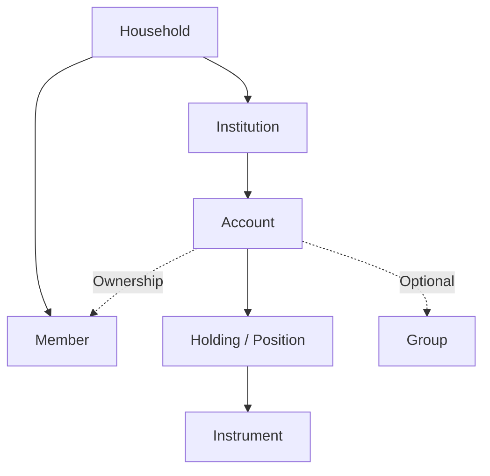

# macOS Net Worth Tracker 产品设计方案 v0.1

## 1. 产品定位

### 1.1 产品目标

开发一款运行于 macOS 26 及以上、首发仅支持 Apple Silicon arm64 的 **个人 / 家庭净资产管理工具（Net Worth Tracker）**。

产品主要用于回答这些问题：

- 我们家庭现在一共有多少资产和负债？
- 这些资产分别属于谁？
- 钱分别放在哪些银行、券商、钱包或投资项目中？
- 不同资产类别分别占多少？
- 相比一个月、一年、三年前，我们的净资产发生了什么变化？
- 净资产增长来自新增储蓄，还是投资收益？
- 股票、基金、Crypto 等投资实际赚了多少钱？
- 汇率变化给跨币种资产带来了多少影响？
- 哪些资产长期没有更新？
- 我当前的资产配置是否符合目标？

核心思想是：

> **管理 Balance Sheet，而不是记录每一杯咖啡。**

用户不需要像传统记账 App 一样录入每一笔消费，只需要维护重要的资产、负债和资金变动。

这与 Percento 的定位比较接近。Percento 同样强调只记录重要财务变化，而不是逐笔记账，并提供净资产、资产负债、Group、多币种、股票/基金价格更新和账户转账等功能。

---

## 2. 产品设计原则

### 2.1 Household First

产品首先面向：

- 个人
- 夫妻
- 家庭

一个单身用户实际上就是只有一个 Member 的 Household。

建议产品内部不要叫 `Team`，而使用：

```text
Household
```

如果未来希望支持家庭信托、公司资产等更复杂场景，内部数据模型可以使用：

```text
Workspace
```

其中：

```text
Workspace.type = household | individual | trust | company
```

首版 UI 只暴露 Household 即可。

---

### 2.2 Local First

财务数据高度敏感，macOS 版本建议：

- 本地数据库作为唯一 Source of Truth
- 不要求注册账号
- 完整离线可用
- 可选 iCloud Sync
- Touch ID / 密码锁
- 自动本地备份
- CSV / JSON 导入导出
- 可恢复历史备份

Percento 已采用离线、不要求登录、可选 iCloud 同步和 CSV 导出的路线。

Wealthfolio 则更进一步采用完全 local-first 的方案，其文档明确说明数据保存在用户机器上的本地 SQLite 数据库中。

这非常适合作为本产品的技术和隐私设计参考。

---

## 3. 核心领域模型

这是整个产品中最重要的一部分。

原始需求是：

```text
Root
└── Member
    └── Account
```

这个模型在简单资产下没问题，但投资账户会出现明显问题。

例如：

```text
MooMoo SG
├── 现金 5,000 SGD
├── QQQ 3 shares
├── VOO 5 shares
└── ES3 1,000 shares
```

如果 MooMoo SG 和 QQQ 都叫 Account，就很难正确表达：

- 券商账户
- 券商现金
- 持仓
- 买卖
- 分红
- 手续费
- 成本价
- 不同市场币种

因此建议采用以下模型。



逻辑层次为：

```text
Household
├── Member
├── Institution
│   └── Account
│       ├── Cash Balance
│       └── Holding
└── Group
```

但 UI 仍然可以提供用户希望的：

```text
Household
├── Walt
│   ├── DBS Multiplier
│   ├── WeChat Wallet
│   └── MooMoo SG
│       ├── QQQ
│       └── ES3
└── Spouse
    ├── DBS Savings
    └── ...
```

即：

> **数据模型和 UI 层级不必完全相同。**

---

# 4. 核心对象

## 4.1 Household

代表一个家庭的完整 Balance Sheet。

主要字段：

| 字段 | 说明 |
|---|---|
| name | Household 名称 |
| baseCurrency | 主币种 |
| locale | Locale |
| defaultLanguage | 默认语言 |
| createdAt | 创建时间 |

例如：

```text
Wang Family

Base Currency:
CNY
```

---

## 4.2 Member

代表家庭成员。

例如：

```text
Walt
Spouse
Child
```

属性：

| 字段 | 说明 |
|---|---|
| name | 姓名 |
| avatar | 头像 |
| note | 备注 |
| archived | 是否归档 |
| sortOrder | 排序 |

---

## 4.3 Ownership

不建议 Account 只包含：

```text
memberId
```

因为现实中大量资产属于夫妻共同所有。

建议采用：

```text
Ownership
- member
- percentage
```

例如：

```text
Home

Walt      50%
Spouse    50%
```

普通个人账户则：

```text
Walt 100%
```

这样未来可以统计：

```text
Family Net Worth
Walt Net Worth
Spouse Net Worth
Joint Net Worth
```

Kubera 已经提供 Owner Tag 和 Nested Portfolio，用于按照个人、Trust 或 Entity 对资产进行所有权划分，这说明“所有权”本身值得成为独立维度，而不仅仅是一个账户字段。

---

# 5. Institution

这是原始需求中建议增加的一个一级对象。

代表：

- 银行
- 券商
- 钱包
- 交易所
- 保险公司
- 基金平台

例如：

```text
DBS
MooMoo SG
Interactive Brokers
WeChat
Alipay
Binance
OCBC
UOB
```

属性：

```text
name
logo
website
country
type
note
```

Institution 和 Group 是两个完全不同的概念。

例如：

```text
Institution: MooMoo SG
Group: Retirement
```

或者：

```text
Institution: DBS
Group: Emergency Fund
```

这样可以统计：

```text
By Institution

DBS             ¥400,000
MooMoo SG       ¥300,000
WeChat          ¥10,000
```

---

# 6. Group

Group 完全由用户创建。

例如：

```text
Emergency Fund
Retirement
Singapore
China
Baby Fund
Long Term Investment
Short Term
```

属性：

```text
name
icon
color
description
sortOrder
archived
```

首版建议：

> 一个 Account 最多属于一个 Group。

后续如果发现一个资产需要同时属于多个逻辑维度，可以再引入：

```text
Tag
```

不要一开始就把 Group 做成复杂的 Many-to-Many 标签系统。

---

# 7. Account

Account 表示一个真实的金融账户或资产容器。

例如：

```text
DBS Multiplier
DBS Fixed Deposit
WeChat Wallet
MooMoo SG
Interactive Brokers
Home
Car
Mortgage
Citi Credit Card
```

建议字段：

```text
id

name
institutionId

primaryCategory
secondaryCategory

groupId?

ownership[]

trackingMode

defaultCurrency

includeInNetWorth
includeInInvestmentPerformance

note
icon

openedAt
closedAt

archived
```

## 7.1 Account Tracking Mode

这是一个很值得加入的概念。

不同资产适合不同的维护方式。

### BALANCE

直接维护余额。

适用于：

```text
现金
银行账户
电子钱包
信用卡
贷款
```

例如：

```text
DBS Savings

Balance: 100,000 CNY
```

---

### HOLDINGS

由持仓计算价值。

适用于：

```text
券商
基金平台
Crypto Exchange
```

例如：

```text
MooMoo SG

Cash:
SGD 5,000

Holdings:
QQQ
VOO
ES3
```

---

### MANUAL_VALUE

只关心当前估值。

适用于：

```text
房产
汽车
收藏品
保险现金价值
应收账款
私人公司股权
```

例如：

```text
Home

Estimated Value:
¥4,000,000
```

---

# 8. Holding / Position

Holding 是投资账户内的持仓。

例如：

```text
MooMoo SG
└── QQQ
```

Holding 包含：

```text
accountId
instrumentId

quantity

averageCost?
costBasis?

manualPrice?
priceSource

note

archived
```

---

# 9. Instrument

Instrument 代表真正的投资标的。

例如：

```text
NASDAQ / QQQ
NASDAQ / NVDA
SGX / ES3
Crypto / BTC
China Fund / 嘉实美国成长QDII
Gold / XAU
```

建议字段：

```text
name
symbol
market
country
currency

instrumentType

priceProvider
providerSymbol

isin?
cusip?

logo
```

这样用户所说的：

> 投资项目：美股/NVDA、新加坡/ES3、中国基金/嘉实美国成长QDII

就不再是简单字符串，而是结构化 Instrument。

---

# 10. 资产分类体系

建议略微调整原始分类。

## 一级分类

```text
Cash Equivalent
Investment
Property
Receivable
Liability
```

UI 中文：

```text
流动资金
投资
固定资产
应收账款
负债
```

---

## 二级分类建议

| 一级 | 二级 |
|---|---|
| 流动资金 | Cash |
|  | Bank Account |
|  | Digital Wallet |
|  | Broker Cash |
|  | Other Cash Equivalent |
| 投资 | Stock |
|  | ETF |
|  | Investment Fund |
|  | Bond |
|  | Crypto |
|  | Precious Metal |
|  | Bank Investment Product |
|  | Insurance |
|  | Private Equity |
|  | Pension / Retirement |
|  | Other Investment |
| 固定资产 | Real Estate |
|  | Vehicle |
|  | Collectible |
|  | Other Property |
| 应收账款 | Loan Receivable |
|  | Other Receivable |
| 负债 | Credit Card |
|  | Mortgage |
|  | Auto Loan |
|  | Consumer Loan |
|  | Personal Debt |
|  | Tax Payable |
|  | Other Liability |

这里建议不要把 `Debit Card` 当成真正的金融资产类型。

借记卡通常只是：

```text
Bank Account
    ↳ Debit Card
```

真正有余额的是 Bank Account。

---

# 11. 多币种与估值系统

## 11.1 三层币种

建议支持：

```text
Household Base Currency
Account Default Currency
Holding / Transaction Currency
```

这和 Percento 的 Main / Account / Transaction Currency 思路类似。

但本产品应允许一个投资 Account 内包含多个币种。

例如：

```text
MooMoo SG

SGD Cash
USD Cash

QQQ → USD
ES3 → SGD
```

因此：

> Account Currency 应只是 Default Currency，而不是 Account 的强制唯一币种。

---

## 11.2 Cash 估值

公式：

```text
Base Value
=
Native Balance × FX Rate
```

例如：

```text
USD Cash

10,000 USD
USD/CNY = 6.90

Value = ¥69,000
```

---

## 11.3 投资持仓估值

```text
Base Value
=
Quantity
× Market Price
× FX Rate
```

例如：

```text
QQQ

Quantity: 3
Price: 700 USD
USD/CNY: 6.9

Market Value:

3 × 700 × 6.9
= ¥14,490
```

---

# 12. Price / FX 数据模型

价格和汇率不要直接写死在 Account 中。

建议存在独立的：

```text
PriceQuote
FXQuote
```

### PriceQuote

```text
instrumentId
price
currency
timestamp
provider
manual
```

### FXQuote

```text
baseCurrency
quoteCurrency
rate
timestamp
provider
manual
```

这样如果家庭有三个账户都持有 QQQ：

```text
MooMoo SG → QQQ
IBKR → QQQ
Other Broker → QQQ
```

刷新时：

> **QQQ 价格只需要查询一次。**

然后三个 Holding 共用。

---

## 12.1 Quote Cache

本地缓存：

```text
Instrument Quote Cache
FX Quote Cache
```

支持：

```text
Refresh All
Refresh Selected
Refresh FX Only
Refresh Investments Only
```

UI 显示：

```text
QQQ
$700.23

Updated:
Today 10:31
```

以及：

```text
Fresh
Delayed
Stale
Manual
Unavailable
```

这对判断数据可信度非常有价值。

---

# 13. 历史数据

不要只保存：

```text
Current Price
Current FX
Current Balance
```

而应该保存历史 Observation。

这样才可以正确计算：

```text
Historical Net Worth
Historical FX Impact
Historical Asset Allocation
Investment Performance
```

同时解决主币种切换问题。

Percento 当前文档特别提醒，切换主币种可能因为缺少历史汇率而影响历史数据显示。

本产品如果从一开始就保留历史 FX Quote，就可以更好地处理：

```text
CNY → SGD
CNY → USD
```

这类主币种切换。

---

# 14. Activity / 变动记录

这是第二个非常关键的模型。

建议把：

```text
用户行为
```

和：

```text
市场估值变化
```

分开保存。

## Activity Event

例如：

```text
Balance Update
Transfer
Deposit
Withdrawal
Buy
Sell
Dividend
Interest
Fee
Tax
Income
Expense
Debt Draw
Debt Repayment
Manual Valuation
Adjustment
```

---

## Market Observation

例如：

```text
QQQ Price:
$690 → $700

USD/CNY:
6.85 → 6.90
```

不要给每个持有 QQQ 的 Account 都创建一次：

```text
QQQ price changed
```

否则会产生大量重复数据。

UI 的 Account Timeline 可以把两类数据合并展示。

例如：

```text
Aug 17

QQQ price updated
$695 → $700

Aug 16

Bought 1 QQQ
$693

Aug 15

USD/CNY updated
6.88 → 6.90
```

但数据库底层仍保持两个数据源。

---

# 15. Transfer

Transfer 应是第一等公民。

例如：

```text
DBS → MooMoo SG
```

基本模型：

```text
Source Account
Destination Account

Source Amount
Destination Amount

FX Rate

Fee
Fee Currency

Date
Note
```

---

## 15.1 同币种转账

```text
DBS

-10,000 CNY

↓

WeChat

+10,000 CNY
```

家庭净资产：

```text
Change = 0
```

---

## 15.2 跨币种转账

例如：

```text
DBS SGD

-1,000 SGD

↓

IBKR USD

+780 USD
```

记录：

```text
Executed FX Rate
Source Amount
Destination Amount
Fee
```

不要完全依赖市场 FX，因为银行实际成交汇率可能不同。

---

## 15.3 信用卡还款

也是 Transfer：

```text
DBS Cash

-5,000

↓

Credit Card Liability

-5,000 liability
```

资产减少 ¥5,000，同时负债减少 ¥5,000：

```text
Net Worth Change = 0
```

这是采用统一 Transfer 模型的一个重要优势。

---

# 16. 股票买入

如果：

```text
MooMoo SG Cash

$2,100
```

购买：

```text
3 QQQ × $700
```

内部实际上发生：

```text
Cash
- $2,100

QQQ Holding
+ 3 shares
```

净资产理论上：

```text
≈ unchanged
```

只有：

```text
Fee
Spread
Market movement
```

才真正影响资产。

这也是为什么不能简单地把：

```text
MooMoo SG
QQQ
```

都当成普通 Account。

---

# 17. Balance Reconciliation

这是我比较建议增加的功能。

假设上次记录：

```text
DBS
¥100,000
```

今天用户更新：

```text
¥93,000
```

系统发现：

```text
Difference:
-¥7,000
```

可以询问：

```text
How should this change be recorded?

○ Balance adjustment
○ Expense
○ Transfer
○ Investment
○ Other
```

如果用户完全不想记账：

```text
Balance Adjustment
```

即可。

但 Analytics 可以明确显示：

```text
Unclassified Change
¥7,000
```

这样：

> 产品不会强迫用户记账，同时又不会假装自己知道这 ¥7,000 到底去了哪里。

这是 Net Worth Tracker 和传统 Bookkeeping App 之间非常合适的平衡。

---

# 18. Statistics Scope

原始需求中有：

```text
是否计入统计
```

建议不要只设计一个 Boolean。

可以拆成：

```text
Include in Net Worth

Include in Investment Portfolio

Include in Liquid Assets
```

例如：

### 自住房

```text
Net Worth            ✓
Investment Portfolio ✗
Liquid Assets        ✗
```

### QQQ

```text
Net Worth            ✓
Investment Portfolio ✓
Liquid Assets        ✓
```

### 收藏品

```text
Net Worth            ✓
Investment Portfolio ✗
Liquid Assets        ✗
```

这样统计意义更明确。

---

# 19. 核心统计

## 19.1 Balance Sheet

首页最重要的信息：

```text
Total Assets

-

Total Liabilities

=

Net Worth
```

支持：

```text
Today
1M
3M
6M
YTD
1Y
3Y
5Y
All
```

---

## 19.2 Net Worth Trend

折线图：

```text
Net Worth
Assets
Liabilities
```

支持按：

```text
Member
Category
Group
Institution
```

筛选。

---

# 20. Net Worth Change Attribution

这一功能很值得重点做。

例如过去一年：

```text
Net Worth
+ ¥350,000
```

分解为：

```text
Salary / Savings       +200,000

Investment Return      +100,000

FX Effect               +30,000

Property Appreciation   +40,000

Fees / Taxes            -20,000
```

最终：

```text
+350,000
```

这比单纯展示：

```text
去年 200 万
今年 235 万
```

更有价值。

---

# 21. 投资收益统计

建议支持至少三类收益指标。

## Absolute Gain

```text
Gain
¥120,000
```

---

## TWR

Time Weighted Return。

更适合比较：

```text
投资策略
基金
账户
Benchmark
```

因为它尽量排除资金流入流出的影响。

---

## XIRR / Money Weighted Return

考虑资金进入时间。

尤其适合：

```text
长期定投
多次投入
多次赎回
房地产
私人投资
```

Kubera 的投资回报功能同样允许用户记录 Cash In / Cash Out，并基于不规则资金流计算 IRR。

因此建议同时支持：

```text
TWR
XIRR
```

而不要只显示简单：

```text
(Current Value - Cost) / Cost
```

---

# 22. 收益组成

投资收益进一步拆分：

```text
Capital Gain

Dividend / Distribution

Interest

FX Gain / Loss

Fees

Taxes
```

例如：

```text
QQQ Total Return

+18.2%

├── Price Return       +15.0%
├── Dividend            +0.8%
├── FX                  +3.1%
└── Fees                -0.7%
```

Sharesight 的投资组合计算会把股息、经纪费用和汇率变化一起纳入投资表现，这一点非常值得参考。

---

# 23. Cost Basis

虽然 Percento 明确把自己定位成净资产管理工具，因此不重点追踪股票买入成本和详细盈亏，官方也建议复杂收益继续查看券商记录。

但你的需求已经包含：

```text
投资收益
收益率
年化收益
```

因此本产品最好把 Cost Basis 作为：

> **Optional Advanced Feature**

而不是完全不支持。

Holding 可以保存：

```text
Quantity
Cost Basis
Average Cost
```

后续再扩展：

```text
Tax Lot
FIFO
LIFO
Specific Lot
```

首版不需要做完整税务系统。

---

# 24. Dashboard

建议首页包含：

## Header

```text
Net Worth

¥3,861,320

+¥28,391
+0.74% this month
```

---

## Summary Cards

```text
Assets
Liabilities
Investments
Liquid Assets
```

---

## Net Worth Chart

```text
1M / 3M / YTD / 1Y / 5Y / All
```

---

## Allocation

按：

```text
Asset Class
Member
Institution
Group
Currency
Country
```

查看。

---

## Recent Changes

例如：

```text
QQQ        +¥3,291
USD/CNY    +¥1,221
DBS        +¥20,000
Mortgage   +¥2,300
```

---

# 25. macOS Information Architecture

建议 Sidebar：

```text
Overview

Accounts
    Walt
    Spouse
    Shared

Groups

Investments

Activity

Analytics

Automation

Settings
```

展开 Member：

```text
Walt
├── DBS
│   ├── Multiplier
│   └── Fixed Deposit
│
├── MooMoo SG
│   ├── Cash
│   ├── QQQ
│   └── ES3
│
└── WeChat
```

---

# 26. Account Detail

Account 页面建议 Tabs：

```text
Overview

Holdings

Activity

Performance

Notes
```

Cash Account 不显示 Holdings / Performance。

投资 Account 则全部显示。

---

# 27. Global Activity

所有重大变化进入一个统一 Timeline。

例如：

```text
Today

QQQ
Price Update
$697 → $700

MooMoo SG
Bought 1 QQQ
$700

DBS
Salary
+SGD 8,000


Yesterday

DBS → MooMoo SG
Transfer SGD 2,000
```

支持按照：

```text
Member
Account
Activity Type
Date
Instrument
```

过滤。

---

# 28. 自动记录 Automation

支持创建 Rule。

例如：

## Salary

```text
Every month
25th

Add:
+SGD 8,000

To:
DBS Multiplier
```

---

## Mortgage

```text
Every month
15th

Transfer:

DBS
→ Mortgage

CNY 10,000
```

---

## 定投

```text
Every month

Buy:
QQQ

Quantity:
1
```

但这里建议区分：

```text
Scheduled
Confirmed
```

因为没有券商 API 时，App 并不知道实际成交：

```text
Price
Quantity
Fee
```

所以自动任务可以先创建：

```text
Pending Activity
```

用户确认真实成交数据后：

```text
Confirmed
```

---

# 29. Automation 类型

建议支持：

```text
Recurring Income

Recurring Expense

Recurring Transfer

Recurring Investment

Recurring Debt Payment

Periodic Manual Valuation Reminder

Periodic Snapshot

Automatic Price Refresh
```

Percento 目前也提供 Auto Transaction，可用于工资、房租、房贷和其他固定收入/支出。

---

# 30. Archive / Close / Delete

需要严格区分：

### Archive

账户不再活跃，但：

```text
历史仍然存在。
```

### Close

记录：

```text
closedAt
```

并保留历史。

### Delete

原则上采用 Soft Delete。

不要物理删除已经参与历史统计的 Account / Activity。

否则：

```text
过去 Net Worth
```

会发生变化。

v0.1.1 的产品契约进一步收紧为：

```text
Member / Institution / Group / Account
→ Archive / Restore only
```

v0.1.1 不显示 Permanent Delete，不提供隐藏的 Danger Zone。Permanent Delete 必须等待 Backup/Export 和 Activity 历史引用规则完成后再设计。

---

# 31. 数据质量

我建议加入一个比较特别的功能：

## Data Freshness

例如：

```text
Household Data Status

96% Fresh
```

下面显示：

```text
DBS          Today
MooMoo       Today
Home         43 days ago ⚠
Car          92 days ago ⚠
Mortgage     5 days ago
```

用户一眼就知道：

> “我的 ¥4.2M Net Worth 到底有多可信？”

对于手工维护资产的 Net Worth Tracker，这个功能非常实用。

---

# 32. i18n

从第一版就应该完成 i18n 基础。

内部不要存：

```text
"股票"
```

而存：

```text
investment.stock
```

然后：

```text
zh-CN → 股票
en-US → Stock
zh-TW → 股票
```

同时正确处理：

```text
Currency
Decimal
Thousands separator
Date
Percentage
Negative amount
```

例如：

```text
CNY:
¥1,234,567.89

SGD:
S$1,234,567.89

German:
1.234.567,89 €
```

Instrument / Institution 名称通常保持原始品牌名称，不强制翻译。

---

# 33. 搜索与操作效率

macOS 版本建议特别加强键盘操作。

例如：

```text
⌘K
```

Command Palette：

```text
Add Account
Add Holding
Transfer
Update Balance
Buy
Sell
Refresh Prices
Search QQQ
Open MooMoo SG
```

另外支持：

```text
⌘N
⌘F
⌘R
```

以及 Context Menu。

---

# 34. 数据导入导出

首版至少支持：

```text
CSV Export
JSON Full Backup
JSON Restore
```

之后支持：

```text
CSV Account Import
Broker CSV Import
Statement Import
```

Wealthfolio 当前已经将通用 CSV 导入作为核心能力之一，可以导入券商或银行 statement。

---

# 35. MVP 范围建议

## V0.1 — Net Worth Core

首版建议控制范围，只完成真正的核心：

```text
Household

Member

Institution

Group

Account

Holding

Instrument

Manual Balance Update

Manual Quantity Update

Manual Price

Multi Currency

FX

Price API

Transfer

Activity History

Net Worth

Asset / Liability Overview

Allocation

Net Worth Trend

Archive

CSV / JSON Export

i18n Framework
```

这是一个已经可以真正长期使用的产品。

---

# 36. V0.2 — Investment

增加：

```text
Buy / Sell

Cost Basis

Dividend

Interest

Fees

Realized Gain

Unrealized Gain

TWR

XIRR

Benchmark

Performance Attribution

Broker CSV Import
```

---

# 37. V0.3 — Wealth Management

增加：

```text
Goals

Target Allocation

Portfolio Rebalancing

Debt Planning

Dividend Forecast

Asset Valuation Reminder

Advanced Automation

Household Sharing
```

---

# 38. V0.4 — Advanced Integration

以后再考虑：

```text
Bank Account Sync

Broker API

Crypto Wallet Sync

Statement Parsing

Browser Extension

AI Import

Plugin SDK
```

这些功能都很容易显著增加产品复杂度，因此不建议进入 MVP。

---

# 39. 竞品调研

## Percento

这是最直接的参考对象。

Percento 的核心方向包括：

```text
Net Worth
Assets / Liabilities
Account Group
Multi Currency
Stock / Fund / Crypto Price Update
FX Update
Account Transfer
Auto Transaction
Charts
Offline Mode
iCloud
CSV Export
```

它明确强调“不必记录每一笔消费，只维护重要财务变化”。

### 最值得借鉴

```text
简单
低维护成本
Balance Sheet First
Transfer First
漂亮的资产配置展示
```

### 可以超越的地方

Percento 官方明确表示，其股票功能主要用于估算当前市值，而不是追踪成本、详细交易和收益。

因此：

> **真正的投资收益分析可以成为本产品相对于 Percento 的重要差异化能力。**

---

# 40. Kubera

Kubera 更像：

> Personal / Family Wealth Balance Sheet

它可以覆盖银行、券商、Crypto、房地产、车辆以及其他非标准资产。

特别值得借鉴的功能包括：

### Ownership

资产可以按照 Person / Trust / Entity 标记所有权。

### Nested Portfolio

可以为不同个人或实体建立独立 Portfolio，再汇总到更高层级。

### Family Collaboration

Kubera Family 支持家庭成员共同访问和管理资产。

### IRR

通过投资 Cash In / Cash Out 计算 IRR。

### Documents

资产可以附带 Notes、Documents，并提供 Financial Document Vault。

### Beneficiary

Kubera 还提供一种 Life Beat / Dead Man's Switch：用户长期无活动并无法取得联系时，可以把相关财务信息提供给预先设置的 Beneficiary。

这是一个非常有意思但明显属于后期的 Family Wealth Management 功能。

---

# 41. Wealthfolio

Wealthfolio 对本项目尤其有参考价值，因为它也是：

```text
Local First
Privacy First
Personal Finance
Investment Tracking
Net Worth
```

其数据保存在本机 SQLite 中，不要求云端账户。

目前已经覆盖：

```text
Investments
Net Worth
Spending
Planning
```

并支持资产负债、投资表现、CSV 导入、Allocation、Rebalancing、目标规划等功能。

它甚至已经加入：

```text
Goals
Retirement / FIRE
Monte Carlo Simulation
```

用于长期资产规划。

另外值得注意的是它提供 Add-on 机制，让核心产品保持简单，同时通过扩展增加高级功能。

这一点很值得你的项目后期借鉴。

---

# 42. Sharesight

Sharesight 的定位更偏：

> Professional Portfolio Performance Tracker

其优势是：

```text
Trades

Dividend

Distribution

Brokerage Fees

Capital Gain

FX

Annualized Performance

Portfolio Reports
```

它会将股息、手续费、资本变化和汇率因素纳入投资收益分析。

另外 Sharesight 支持大量全球证券，包括股票、ETF、基金、Crypto 和非上市资产。

因此：

> 本产品的 Net Worth 部分可以参考 Percento / Kubera，Investment Performance Engine 可以参考 Sharesight。

---

# 43. Monarch Money

Monarch 更偏完整 Personal Finance，但它的 Household 设计值得参考。

它允许夫妻或家庭成员：

```text
Shared Household

Separate Login

Joint Dashboard

Individual Accounts

Goals

Net Worth
```

家庭成员可以在一个共享空间中贡献各自账户和数据。

因此你的：

```text
Household → Member → Account
```

方向非常合理。

后期如果加入 Sync，可以考虑：

```text
Account Owner
Shared Account
Viewer
Editor
```

这样的权限体系。

---

# 44. Ghostfolio

Ghostfolio 是另一个值得技术层面参考的项目，它定位为 privacy-first、open-source 的 Personal Finance Dashboard，可以聚合现金、股票、ETF 和 Crypto 并计算 Net Worth。

如果未来产品考虑：

```text
Self-hosted
Plugin
API
Web companion
```

可以研究 Ghostfolio 的实现方式。

---

# 45. 建议增加的 Feature Backlog

综合这些竞品以及当前需求，我认为以下功能值得纳入规划。

| Priority | Feature | 建议 |
|---|---|---|
| P0 | Institution | 应加入核心模型 |
| P0 | Account / Holding 分离 | 必须 |
| P0 | Joint Ownership | 强烈建议 |
| P0 | Balance / Holdings / Manual Value Tracking Mode | 强烈建议 |
| P0 | Internal / External Flow 区分 | 收益统计基础 |
| P0 | Historical FX | 多币种历史基础 |
| P0 | Historical Price | 投资历史基础 |
| P0 | Data Freshness | 非常适合手工 Net Worth Tracker |
| P0 | Balance Reconciliation | 大幅降低维护成本 |
| P0 | Backup / Export | 财务软件必须 |
| P1 | Optional Cost Basis | 投资收益 |
| P1 | Dividend / Interest | 投资收入 |
| P1 | TWR / XIRR | 专业收益统计 |
| P1 | Benchmark | 与 QQQ/SPY 等比较 |
| P1 | Portfolio Target | 目标资产配置 |
| P1 | Rebalancing | 调仓建议 |
| P1 | Goals | 买房、教育、退休等 |
| P1 | Debt Metadata | 利率、到期时间、月供 |
| P1 | CSV Import | 大幅降低录入成本 |
| P1 | Attachments | 房产、保险等特别实用 |
| P1 | Household Sharing | 夫妻共同使用 |
| P2 | Dividend Forecast | 预计投资收入 |
| P2 | FIRE / Retirement | 长期规划 |
| P2 | Bank Sync | 高成本集成 |
| P2 | Broker Sync | 高成本集成 |
| P2 | Crypto Wallet Sync | 可后期添加 |
| P2 | Web Sync | 从银行网页本地提取余额 |
| P2 | Document / Screenshot AI Import | 降低录入成本 |
| P2 | Plugin SDK | 扩展数据源 |
| P2 | Financial Document Vault | 家庭资产档案 |
| P2 | Beneficiary / Emergency Export | 家庭财富传承 |

---

# 46. 一个很重要的产品边界

建议明确规定：

## 本产品做

```text
What do I own?

What do I owe?

Where is my money?

Who owns it?

How has my wealth changed?

Why has it changed?

How are my investments performing?
```

## 本产品暂时不做

```text
今天早餐 ¥32

出租车 ¥28

咖啡 ¥21

Netflix ¥68

每个月餐饮预算 ¥5,000
```

否则产品会很快变成：

```text
YNAB
Monarch
Copilot
MoneyWiz
```

这样的完整 Personal Finance / Budgeting 产品。

而原本最有价值的：

> **低维护成本的家庭资产负债表**

会被稀释。

---

# 47. 产品核心差异化

如果把产品最终定位总结成一句话，我会建议：

> **A private, local-first balance sheet and investment tracker for individuals and families.**

核心能力形成三个层次：

```text
                   Net Worth
                       │
        ┌──────────────┴──────────────┐
        │                             │
  Balance Sheet                 Investment
        │                         Performance
        │                             │
Household / Member              TWR / XIRR
Asset / Liability               Gain / Loss
Currency / FX                   Dividend
Ownership                       FX Attribution
        │                             │
        └──────────────┬──────────────┘
                       │
                    History
                       │
              Activity + Valuation
```

相比 Percento：

```text
更强的家庭模型
更强的投资收益
更严谨的历史数据
```

相比 Sharesight：

```text
更完整的家庭 Balance Sheet
```

相比 Kubera：

```text
更轻量
更适合个人使用
更强调 Local First
```

相比 Monarch / Copilot：

```text
不陷入详细记账和 Budgeting
```

相比 Wealthfolio：

```text
可以更加 Household First
并把多成员所有权作为核心概念
```

最终这个产品比较理想的定位不是“记账软件”，甚至也不只是“Portfolio Tracker”，而是：

# Personal / Family Wealth Ledger

或者：

# Household Balance Sheet

用户打开 App 最重要的不是知道：

> “今天花了多少钱？”

而是知道：

> **“我们现在拥有什么、欠什么、这些财富放在哪里，以及它正在如何变化。”**
