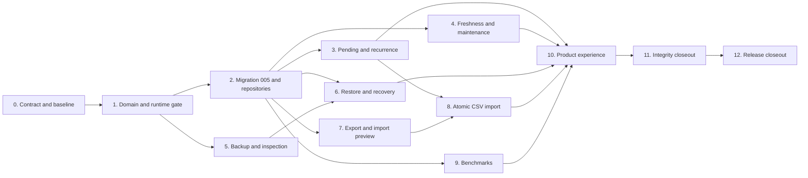

# v0.1.5 Implementation Plan

## Execution Contract

This plan turns the [v0.1.5 release contract](v0.1.5.md), [technical design](v0.1.5-technical-design.md), and [compatibility baseline](v0.1.5-baseline.md) into dependency-ordered phases.

**Status:** `Phase 11 implemented; Phase 12 planned`. The repository version is already `0.1.5`, but version synchronization is not feature evidence.

Execute phases in order unless the dependency graph explicitly permits parallel frontend work. A phase is complete only when its domain, persistence, transactions, IPC, frontend, localization, accessibility, compatibility, and documentation obligations are proven.

Do not run Tauri development, Restore, reset, migration smoke tests, or release bundles against the only copy of real financial data. Use committed sanitized fixtures and explicit isolated application-data directories.

## Dependency Flow

## Phase 0 — Contract, Baseline, and Fixtures

### Deliverables

- Approve all four v0.1.5 design documents and freeze their locked decisions.
- Reverify the [v0.1.5 baseline](v0.1.5-baseline.md): schema `004`, 81 commands, capabilities, test counts, bundle size, query bounds, and financial/analytics goldens.
- Add a sanitized schema-4 fixture containing:
  - Complete History Origin and effective-dated state
  - Activities of every import-supported kind, reversal, and correction
  - Historical quotes and snapshot revisions
  - Known- and unknown-basis lots under deterministic replay
  - Active and revoked cost-basis declarations
  - Archived retained references and media
- Add v0.1.5 golden specifications for recurrence dates, import rows, Backup manifest, Benchmark comparison, and search order.
- Decide exact maintained ZIP, SHA-256, and CSV crates after license, feature, binary-size, security, and duplicate-native-library review.
- Freeze existing query counts and the v0.1.4 main-chunk baseline.

### Exit checks

- No open decision can change migration shape, pending kinds, recurrence overflow, Restore protocol, import atomicity, Benchmark formula, or search boundary.
- `bun run check` and `git diff --check` pass before implementation.
- Fixtures contain no personal data, selected path, credential, provider payload, or real financial record.

### Phase 0 evidence

- `src-tauri/test-fixtures/v0.1.4.sql` is a sanitized schema-4 fixture with the complete History Origin, effective-dated state, every current Activity shape, reversal/correction evidence, historical quotes, revised snapshots, known/unknown-basis holdings, archived references/media, and active/revoked declarations.
- `src-tauri/test-fixtures/v0.1.5-goldens.md` freezes recurrence, canonical import fingerprints, Backup manifest/archive boundaries, Benchmark comparison, and search ordering.
- `sanitized_v014_fixture_loads_on_schema_004_with_analytics_prerequisites` loads the fixture through migrations `001`–`004`, verifies integrity and foreign keys, and checks the declaration chain.
- The v0.1.4 read/query and main-chunk baselines, plus the selected ZIP/SHA-256/CSV crate versions, are recorded in [v0.1.5-baseline.md](v0.1.5-baseline.md).

## Phase 1 — Domain Types and Runtime Operation Gate

### Deliverables

- Add typed UUID v7 IDs for rules, pending items, policies, snoozes, imports, Benchmarks, Benchmark observations, and Backups, plus their closed enums.
- Implement `BenchmarkLevel`, schedule interval, carry-window, import-template, checksum, and format-version value objects.
- Implement calendar recurrence with immutable anchors and last-valid-day clamping.
- Implement typed pending/recurring payload validation without raw legs or generic financial JSON.
- Implement canonical import row fingerprints over persisted facts.
- Add the shared/exclusive application operation gate and terminal `restart_required` runtime state.
- Make every Tauri command acquire a shared permit and make reset infrastructure acquire the exclusive permit.

### Required tests

- ID type separation and UUID v7 generation.
- Benchmark level positivity, scale, overflow, and no binary floats.
- Daily/weekly/monthly/yearly intervals and bounds.
- January 31, leap-day, DST-zone local date, end-date, and catch-up sequences.
- Recurring-kind allowlist rejects Buy/Sell, position/cross-currency Transfer, Adjustment, and Valuation.
- Manual pending allowlist rejects Opening Adjustment, Adjustments, Valuation, Reversal, and Correction.
- Canonical fingerprint changes for every persisted fact and ignores display-only labels.
- Source namespace and external-ID syntax, canonical byte encoding, and SHA-256 fingerprint golden vectors.
- Shared commands may coexist; exclusive transition waits for active commands and blocks new commands.
- Terminal runtime state returns `APP_RESTART_REQUIRED` without touching a closed pool.
- Existing unsupported-future and reset tests retain stable behavior.

### Exit checks

- Domain code has no SQL, Tauri UI, provider, dialog, or arbitrary filesystem dependency.
- Existing 81 commands pass through the operation gate without semantic change.
- Rust unit tests, formatting, and Clippy pass.

### Phase 1 evidence

- `src-tauri/src/domain/ids.rs` adds the nine UUID v7 identities; `src-tauri/src/domain/sustainable.rs` contains the bounded Decimal, schedule, typed payload, import-template, checksum, and format-version contracts.
- Schedule tests cover daily, weekly, monthly, yearly, leap-day, immutable-anchor month-end clamping, end-date/catch-up bounds, and a New York DST local-date cutoff. Import tests match the Phase 0 canonical byte length, SHA-256 golden, amount mutation vector, and display-label exclusion.
- `src-tauri/src/state.rs` owns the application-wide shared/exclusive gate. `delete_all_data` acquires exclusive access, marks `restart_required` before closing the pool, and later database access returns `APP_RESTART_REQUIRED`.
- All 81 commands in `src-tauri/src/ipc.rs` are covered: 80 ordinary commands acquire shared permits and `delete_all_data` delegates to the exclusive reset boundary. Rust verification recorded 412 passing library tests, `cargo check --all-targets --all-features`, and Clippy with `-D warnings`.

## Phase 2 — Migration 005, Repositories, and Initialization

### Deliverables

- Add `005_sustainable_use.sql` with the tables, indexes, row-shape checks, and foreign keys defined by the technical design.
- Add repositories for rules, pending items, policies, snoozes, import provenance, Benchmarks, observations, and preference.
- Add idempotent post-migration policy-default initialization before runtime readiness.
- Extend fresh onboarding to create exactly four default policies atomically.
- Extend reset cleanup to schema-5 sidecars, restore staging/rollback files, and application-owned recovery copies.
- Preserve pre-migration snapshot and unsupported-future state machine at supported version `5`.

### Required tests

- Fresh database reaches migration `5` exactly once.
- Migration SQL creates schema and zero v0.1.5 business rows.
- Existing Household initialization creates four defaults once; reopen creates no duplicate.
- Initialization failure exposes no partial default set and blocks readiness with a stable status.
- Fresh onboarding creates Household, settings, History Origin, and four policies once or writes nothing.
- v0.1.1–v0.1.4 fixtures migrate with byte-identical old rows and unchanged goldens.
- Migration creates zero Activities, legs, snapshots, quotes, declarations, rules, pending items, imports, or Benchmarks.
- Future migration `6` remains byte-for-byte unchanged.
- `foreign_key_check` and `integrity_check` pass.
- Repository ordering, uniqueness, retained archive references, and query indexes match the contract.

### Exit checks

- Migration has no trigger, old-table reinterpretation, raw financial JSON, search index, or default business event.
- Physical schema is documented without copying full SQL.

### Phase 2 evidence

- `src-tauri/migrations/005_sustainable_use.sql` is schema-only and adds the nine responsibilities documented in the technical design: recurring rules, pending activities, freshness policies, maintenance snoozes, import batches/items, Benchmarks, Benchmark observations, and the Household Benchmark preference. Its typed columns, closed-value checks, provenance `RESTRICT` foreign keys, uniqueness constraints, and bounded query indexes are enforced without triggers or raw financial JSON.
- `freshness_policy_service` initializes exactly the four Household defaults (`account_value=30`, `account_cash=30`, `instrument_quote=7`, `fx_quote=7`) in an idempotent `BEGIN IMMEDIATE` transaction, preserves existing intervals, and blocks readiness with `PolicyInitializationFailed` after rollback on initializer failure. Empty databases remain policy-free until onboarding.
- Onboarding creates Household, members, settings, History Origin, and the four defaults in one transaction. `delete_all_data` also removes only database-derived WAL/SHM, pre-migration, restore staging/rollback, and application-owned recovery artifacts; user-selected files are outside this cleanup boundary.
- `sustainable_repositories` provides bounded, deterministic reads and typed inserts for all Phase 2 tables, including pending keyset pagination, append-only Benchmark observations, import identity lookup, and preference upsert. Repository tests verify stable ordering, typed payload round trips, provenance retention, and reopen behavior.
- Bootstrap compatibility tests verify fresh migration `5`, schema-only zero rows for new business tables, v0.1.1–v0.1.4 fixture compatibility, unchanged legacy goldens, and a future migration `6` that remains blocked without application writes.
- Verification: `cargo test --all-targets` (415 Rust tests), `cargo fmt --all -- --check`, `cargo clippy --all-targets --all-features -- -D warnings`, `git diff --check`, and `bun run check` passed; the latter also passed 155 frontend tests and the production build.

## Phase 3 — Pending Activities and Recurrence

### Deliverables

- Implement manual pending create, update, list, preview, skip, and post.
- Implement recurring rule list/create/update/archive/restore.
- Implement bounded and idempotent due generation.
- Delegate pending preview/post to existing Activity preview and ActivityService.
- Persist terminal pending-to-Activity links without changing Activity rows.
- Add keyset pagination and bounded reference loading.
- Add thin IPC commands and generated bindings for this phase.

### Required tests

- Open pending facts are editable; posted/skipped rows are immutable.
- Pending rows affect no Overview, Account, Portfolio, History, lot, gain, return, or attribution read.
- Future pending is accepted while future posted Activity remains rejected.
- Due posting writes Activity, projections, dirty date, and pending terminal state once or nothing.
- Stale preview revalidates and fails without terminal transition.
- Concurrent post attempts permit one winner.
- Generation writes at most 366 unique due occurrences and reports continuation.
- Repeated generation creates no duplicate for a rule/date.
- Rule payload/end-date edit increments revision and leaves generated pending rows unchanged; anchor, cadence, interval, and start date cannot change.
- Archive stops generation; restore resumes from the anchored ungenerated sequence.
- Invalid or archived rule references produce a blocked diagnostic and no occurrence until repaired/restored.
- Same-currency recurring Transfer remains net-worth/external-flow neutral.
- No recurring input can smuggle cross-currency, trade, position, Adjustment, or Valuation facts.
- Query counts remain bounded.

### Exit checks

- No rule code calls ActivityService's ledger mutation path except the explicit post-pending path; shared reference validation is non-mutating.
- No frontend or importer constructs raw legs.
- `bun run ipc:generate` and `bun run ipc:check` pass.

### Phase 3 evidence

- `pending_service` exposes typed tagged payloads for manual pending Activities and the seven safe recurring payload families. Create/update validates current references but writes only `pending_activities`; no Overview, Account, Portfolio, History, lot, gain, return, or attribution row is changed until the explicit post boundary.
- Pending preview delegates to `ActivityService::preview_in_tx`; pending post delegates to `ActivityService::post_in_tx` in the same write transaction and then records only the terminal `posted_activity_id`. Open rows remain editable, while posted/skipped rows are immutable. The post path rechecks the scheduled local date, current references, History Origin timezone, and activity time, so stale previews and concurrent losers leave the proposal open or return a terminal conflict.
- Recurring rules persist immutable cadence/interval/start/anchor fields, increment revision on payload/end-date edits, and preserve already generated rows with their original revision. `Schedule::occurrences_after` continues from the anchored sequence, including month-end clamping; generation is capped at 366 rows per call, uses the `(recurring_rule_id, scheduled_local_date)` uniqueness boundary, reports continuation, and returns stable blocked diagnostics for archived/invalid references.
- Pending listing uses bounded keyset pagination. All 11 Phase 3 commands acquire the shared operation gate, remain thin command adapters, and are present in `ipc.rs`, capabilities, and generated TypeScript bindings. No raw legs, generic financial JSON, filesystem capability, or provider call is introduced.
- Migration 005's fee-kind checks now explicitly allow the optional fee pair on `transfer` and `debt_payment`, while domain validation still rejects cross-currency recurring Transfer and unsafe recurring kinds. Same-currency recurring Transfer is proven net-worth neutral after posting.
- Verification: `bun run check` passed, including version/IPC checks, ESLint, TypeScript typecheck, 155 frontend tests, production build, 423 Rust tests, formatting, and Clippy with `-D warnings`; `git diff --check` also passes.

## Phase 4 — Freshness Policies and Maintenance Service

### Deliverables

- Implement policy resolution: typed target override, then Household default.
- Implement current/due/overdue/missing and snooze overlay in the History Origin timezone.
- Implement policy list/update and append-only snooze commands.
- Implement one batched Maintenance query combining valuation review and due pending items.
- Keep current provider Fresh/Delayed/Stale semantics unchanged.

### Required tests

- Default and override precedence is deterministic.
- Disabled policy produces no reminder.
- Day boundaries, leap day, DST zone, missing observation, exact due date, overdue date, and snooze expiry are correct.
- New observation resolves a reminder without changing/deleting snooze evidence.
- Wrong-Household, wrong-kind target, archived-new-target, malformed interval, and duplicate override write nothing.
- Archived targets disappear from the Maintenance queue while retained policies resume after restore; manual-quote reminders follow the selected Manual preference only.
- Policy/snooze changes leave every financial row, snapshot, dirty marker, total, lot, gain, return, and attribution byte-identical.
- Maintenance batches observation and reference reads without N+1.

### Exit checks

- Freshness is a maintenance label only and never becomes a valuation filter.
- No OS notification, provider refresh, or background task is added.

### Phase 4 evidence

- `maintenance_service` resolves an active typed target override before the Household default, validates Account/Instrument ownership and tracking-mode compatibility, normalizes FX pairs, bounds review intervals to `1..=3650` or disabled, and keeps policy target identity immutable on update. Duplicate overrides and invalid or archived new references roll back without a settings row write.
- The Maintenance read uses the confirmed History Origin IANA timezone for local today and derives `current`, `due`, `overdue`, `missing`, and effective `snoozed` status from calendar dates. Snoozes are append-only, keyed to typed targets rather than observation IDs; a later observation changes the underlying status while retaining snooze evidence.
- The queue combines active Balance/Manual Value Account observations, Holdings-account cash components, active manually selected Instrument quotes, required manually selected FX pairs, and due open Pending Activities. Archived targets are omitted while retained policies resume after restore. Provider quote Fresh/Delayed/Stale behavior remains untouched.
- Four Phase 4 commands acquire the shared operation gate, stay as thin IPC adapters, and are present in the frozen capability allowlist and generated bindings: `list_maintenance_items`, `list_freshness_policies`, `update_freshness_policy`, and `snooze_maintenance_item`.
- Batch coverage is proven by a single latest-account-value window query, the existing set-based valuation snapshot/quote reads, and one bounded due-Pending query; the service has no per-target database loop.
- Verification: `bun run check` passed, including version/IPC checks, ESLint, TypeScript typecheck, 155 frontend tests, production build, 430 Rust tests, formatting, and Clippy with `-D warnings`.

## Phase 5 — Backup Creation and Inspection

### Deliverables

- Add narrowly configured ZIP, SHA-256, and streaming helpers.
- Implement consistent database copy to app-owned temporary storage.
- Implement manifest serialization, bundle write, flush/sync, readback, checksum, and atomic destination replacement.
- Implement read-only structural inspection with exact entry allowlist and streamed size enforcement.
- Add Save dialog permission only and keep file operations in Rust.
- Implement opaque inspection-token storage in process memory.

### Required tests

- Backup under WAL contains all committed rows and no uncommitted row.
- Bundle has exactly the two allowed regular entries and deterministic manifest fields.
- Written bundle checksum and byte length match readback.
- Existing destination is unchanged on every injected failure before final rename.
- Wrong extension, invalid destination, overwrite without confirmation, and temporary-write failure are safe.
- Duplicate/extra/traversal/absolute/symlink/encrypted entries, oversized manifest, wrong size, checksum mismatch, and truncated ZIP are rejected.
- Inspection writes no database row and does not log or return a path.
- Backup contains BLOB media and every schema-5 table but excludes WAL/SHM, logs, migration snapshots, and recovery files.
- No user path is interpolated into SQL.

### Exit checks

- Success is impossible before checksum readback.
- Frontend has no filesystem capability.
- Dependency and archive-fuzz review has no unresolved high-risk finding.

### Phase 5 evidence

- `backup_service` validates the supported writable database, creates a randomized application-owned temporary directory, uses `VACUUM INTO` with a Rust-generated SQLite literal, and verifies integrity, foreign keys, migration metadata, the schema-5 object allowlist, and stable Household readback before writing the bundle.
- The bundle writer emits the exact `manifest.json` then `database.sqlite3` regular-file entries, stores the manifest in the Phase 0 golden property order, streams SHA-256 and byte length, flushes and syncs the temporary archive, reopens it for manifest/size/checksum readback, then atomically renames it and syncs the destination directory. Existing destinations are not touched before final rename.
- Inspection is read-only and stages only the exact database entry into an application-owned temporary directory. It rejects unsafe names, duplicate/extra/directory/symlink/encrypted entries, unsupported compression, oversized or truncated streams, invalid migration/schema metadata, and checksum mismatches. The source path is retained only inside a short-lived process-local opaque token record and is never returned or logged.
- `create_backup` and `inspect_backup` remain thin gated IPC adapters; generated TypeScript bindings include their typed inputs/DTOs. The only added capability is `dialog:allow-save`; no filesystem plugin or frontend filesystem capability was added.
- Verification: the 12 `application::backup_service::tests` pass; `bun run ipc:check`, `cargo clippy --all-targets -- -D warnings`, `cargo fmt --all -- --check`, `git diff --check`, 155 frontend tests, TypeScript typecheck, and Vite production build pass. The repository-wide Rust suite reports 436 passed and 6 unrelated existing attribution failures under the current date environment; no Phase 5 test fails.

## Phase 6 — Restore, Recovery, and Runtime Quiescence

### Deliverables

- Implement token-bound revalidation and app-owned staging extraction.
- Implement staged migration `001..004 → 005` plus normal idempotent initializers without modifying the selected bundle.
- Implement staged SQLite and application consistency validation.
- Implement exact per-migration schema fingerprints/allowlists, `trusted_schema=OFF`, and rejection of unexpected triggers, views, virtual tables, or attached schemas before staged migration.
- Implement a verified timestamped recovery Backup bundle, safe recovery listing/inspection, and a short-lived raw rollback copy where required by replacement.
- Implement exclusive runtime transition, pool close, sidecar cleanup, atomic replace, rollback, and restart-required result.
- Add recovery-Backup list/restore support, explanation, and reset cleanup.

### Required tests

- Schema 1–5 bundles restore through staging and reopen at schema 5.
- Schema 6/future, wrong product, corrupt, unexpected-object, trigger/view/virtual-table, structurally invalid, incomplete-origin, broken-ledger, projection-mismatch, and broken-declaration databases are rejected before current mutation.
- Inspection-token expiry, source replacement, size/mtime change, and checksum change require reinspection.
- Active database remains byte-identical until explicit confirmation and verified recovery Backup.
- Concurrent ordinary commands finish before exclusive replacement; new commands are blocked.
- Every injected close/rename/fsync failure either leaves current data active or restores verified recovery data.
- Successful restore makes every later command return restart-required without touching SQLite.
- Next bootstrap reads the restored data and all fixture goldens.
- Selected bundle is byte-identical after success or failure.
- Recovery Backup is listed by opaque ID, passes normal inspection, and can restore without exposing its path.
- Recovery Backups are never automatically deleted; explicit Delete All Data removes only application-owned copies.
- User-selected external backup is never deleted by reset.

### Exit checks

- There is no merge/selective restore or in-process continued use after replacement.
- No real user database is the only test copy.

### Phase 6 evidence

- `restore_service` revalidates the inspection token against canonical path identity, size, mtime, and SHA-256, extracts the database entry into an application-owned `{database}.restore-staging-*` directory, and never modifies the selected bundle.
- Staging opens with `trusted_schema=OFF`, rejects attached schemas plus triggers/views/virtual tables, and checks the exact per-migration schema fingerprint for `001`–`005` before running embedded migrations, History Origin initialization, and freshness-policy defaults. Schema 6/future backups are rejected before current mutation.
- After staged migration, restore rechecks the schema-5 fingerprint and application consistency (origin, ledger, projections, snapshots, declarations, automation, and Benchmarks), then writes and readback-verifies a timestamped format-v1 recovery Backup beside the live database.
- Replacement acquires the exclusive operation permit, marks `restart_required` with reason `restore`, closes the pool, removes WAL/SHM, copies a short-lived rollback file, and atomically renames staging onto the live path. Injected close/rename/fsync failures leave current household data active or restore it from the verified recovery bundle. Later commands return `APP_RESTART_REQUIRED` without touching SQLite.
- `list_recovery_backups` and `inspect_recovery_backup` expose opaque Backup IDs, safe manifest metadata, and an explanation string without filesystem paths. Restore from a recovery inspection token uses the same validation path. `delete_all_data` removes application-owned recovery copies and restore artifacts, never a user-selected backup outside those prefixes.
- Thin IPC adapters: `restore_backup` is exclusive inside the service (no shared permit); `list_recovery_backups` and `inspect_recovery_backup` use the shared gate. Generated TypeScript bindings include the new commands and DTOs. No filesystem plugin or frontend filesystem capability was added. Settings Data Management UI remains Phase 10.
- Verification: 11 `application::restore_service::tests` and 12 `application::backup_service::tests` pass; `capabilities_test` (7), `bun run ipc:check`, `cargo clippy --all-targets -- -D warnings`, `cargo fmt --all -- --check`, and `git diff --check` pass.

## Phase 7 — Canonical Export and CSV Preview

### Deliverables

- Define versioned canonical JSON v1 DTOs and deterministic section ordering.
- Implement streaming JSON export from one consistent read snapshot.
- Define exact versioned CSV headers for Activities, manual Quotes/FX, and Benchmark observations.
- Implement RFC 4180 export with spreadsheet hardening and canonical strings.
- Implement strict CSV parser, row DTOs, syntax validation, typed reference batching, dry-run domain replay, diagnostics, and preview tokens.
- Add export/import commands, file privacy warnings, and safe temporary replacement.

### Required tests

- Identical database state produces byte-identical canonical JSON except explicitly documented export metadata.
- JSON includes every promised fact/identity/BLOB and excludes every transient/derived item.
- CSV round-trips canonical fields through the Nestworth parser, including spreadsheet-hardened free text.
- Unknown/missing/duplicate columns, bad template/version, bad UTF-8, NUL, malformed quoting, localized values, and row 2001 are rejected.
- Preview writes nothing and holds no file handle afterward.
- Diagnostics contain row/field/code but no sensitive value or path.
- Batched reference lookup has no per-row SQL query.
- Preview token expires and is bound to canonical path identity, file metadata, and SHA-256.

### Exit checks

- JSON is not accepted as Restore or Import input.
- CSV represents kind-specific inputs, never raw legs or SQL rows.

### Phase 7 evidence

- Canonical JSON v1 is `com.nestworth.export` / `"1"`, streamed from one SQLite read snapshot with deterministic section order. Compact UTF-8 JSON has no trailing newline. The only varying metadata is `exportedAt`; `productVersion` and `databaseMigrationVersion` are stable for a given build/schema. Media BLOBs are base64. JSON includes household, settings, catalogs, ownership, media, instruments/holdings, cash and account-value observations, quotes, FX preferences, History Origin and items, activities and legs, state/snapshot evidence, declarations, and schema-5 automation/import/Benchmark tables. It excludes `holding_quantity_values`, `history_snapshot_state`, derived lots/gain/return/attribution, and Restore/import tokens. JSON is rejected as Restore input even when renamed to `.nestworth-backup`, and preview rejects `.json` / `.nestworth-backup`.
- CSV templates are `activity:v1`, `quote:v1`, and `benchmark:v1`. Product instrument and FX quote datasets share `quote:v1` with `quote_kind=instrument|fx`; there is no fourth template. Headers are exact and ordered in `csv_template.rs`. Export is RFC 4180 (UTF-8, comma, CRLF via `csv` 1.4.0), spreadsheet-hardens leading `= + - @ tab CR` with a reversible `escaped_for_spreadsheet` column, and writes kind-specific `CreateActivityInput` fields rather than raw legs or SQL rows.
- `preview_csv_import` parses strictly (unknown/missing/duplicate headers, bad template, bad UTF-8, NUL, malformed quoting, localized values, and row 2001 rejected), batches reference and identity lookups (`csv_preview.accounts_batch` and siblings; no per-row `account_by_id`), dry-runs domain replay on a read snapshot via `preview_create_activity_in_tx`, and returns row/field/code/severity diagnostics without sensitive values or paths. Preview writes nothing and drops the file handle before return. Tokens expire after 30 minutes and bind canonical path identity, size/mtime/device/inode, and SHA-256. `commit_csv_import` remains Phase 8; `revalidate_csv_preview_token` is `pub(crate)` for tests and that later commit path.
- Thin IPC adapters `export_canonical_json`, `export_csv`, and `preview_csv_import` acquire the shared operation gate. Destinations use a unique temp file, fsync, and atomic rename; existing files require `overwriteConfirmed`. Privacy warning is an IPC string on export DTOs (`EXPORT_PRIVACY_WARNING`). No filesystem plugin or frontend filesystem capability was added. Export does not treat `.nestworth-backup` as Restore/Import input and does not delete `{dbname}.recovery-*` files. Settings Data Management UX remains Phase 10.
- Verification: 2 `domain::csv_template` tests, 6 `application::export_service` tests, 4 `application::csv_preview_service` tests, and 7 `capabilities_test` tests pass; `bun run ipc:generate` / `bun run ipc:check`, `cargo clippy --all-targets -- -D warnings`, `cargo fmt --all -- --check`, and `git diff --check` pass.

## Phase 8 — Atomic CSV Import and Provenance

### Deliverables

- Implement commit-time file re-open, identity/hash verification, reparse, and revalidation.
- Implement source namespace/external ID idempotency and canonical fingerprint conflicts.
- Implement transaction-scoped Activity/observation helpers and one-transaction Activity, manual Quote, manual FX, and Benchmark imports without nested transactions.
- Route Activities through ActivityService and observations through existing append validators.
- Persist batch/item outcomes and typed entity links without source path or raw row.
- Add import-batch cursor list and detail diagnostics.

### Required tests

- Commit fails when file changes after preview.
- A file with one invalid non-duplicate row writes nothing.
- Exact duplicate identity/content is skipped; identity/content conflict rejects the import.
- No-external-ID duplicate-looking rows warn but are not guessed duplicates.
- Reimport of one committed batch posts/appends nothing.
- Imported Activities cannot be future, pre-origin, raw-leg, Opening, Reversal, or Correction records.
- Sequential Activity rows validate against state produced by earlier accepted rows in deterministic order.
- Import failure at every persistence point rolls back business rows and provenance.
- Imported Quotes are Manual and append-only; preferences do not change implicitly.
- Cost-basis declarations remain unchanged and no imported row is interpreted as a declaration or acquisition for an existing declared lot.
- Import provenance cannot update/delete its target.
- Unsupported future database receives zero writes.

### Exit checks

- Import has exactly one commit boundary and a hard 2,000-row limit.
- No importer adapter for an external institution is included.

### Phase 8 evidence

- `commit_csv_import` requires `confirmed`, calls `writable_db()` before token work (unsupported-future databases receive zero writes), then reopens the previewed file inside one `BEGIN IMMEDIATE`. Token missing/expired maps to `IMPORT_PREVIEW_EXPIRED`. Identity, metadata, or SHA-256 mismatch after a valid token maps to a distinct `IMPORT_FILE_CHANGED`. The commit path revalidates via `revalidate_csv_preview_token`, reparses with the Phase 7 parser (JSON/backup extensions still rejected; hard 2,000-row limit unchanged), and persists accepted rows plus provenance in that same transaction. Nested transactions are not used.
- Activities post through `post_create_activity_in_tx` → `activity_service::post_in_tx`. Manual instrument/FX quotes append through `append_imported_manual_*_in_tx` (`QuoteSourceKind::Manual`, no preference mutation). Benchmark observations insert after existing `BenchmarkLevel` / `CalendarDate` / note / catalog validators with `source_kind=csv` and `import_item_id=NULL` (avoids circular FK and later mutation of the observation). `opening_adjustment`, `reversal`, and `correction` kinds are forbidden; there is still no fourth CSV template and no institution importer.
- Namespace/external-id identity is exact-match only: same identity and fingerprint skips posting and links provenance to the original typed target; identity/content mismatch rejects the whole import (`IMPORT_DUPLICATE_CONFLICT`). Rows without external IDs warn (`CSV_NO_IDENTITY`) and are never guessed as duplicates. Any invalid/conflict row writes nothing. Only `status=committed` batches are persisted. Activity rows apply in deterministic `effective_local_date`, `effective_local_time`, then CSV row-number order so later rows see earlier accepted in-tx state. Provenance stores batch/item outcomes and typed entity IDs without source path or raw row. Logs emit template and counts only.
- Thin IPC adapters `commit_csv_import`, `list_import_batches` (opaque keyset cursor), and `get_import_batch` (item diagnostics) use the shared operation gate. No filesystem plugin or frontend filesystem capability was added. Settings Data Management UX remains Phase 10. Recovery `{dbname}.recovery-*` files are not auto-deleted.
- Verification: 12 `application::csv_import_service` tests, 4 `application::csv_preview_service` tests, and 7 `capabilities_test` tests pass; `bun run ipc:generate` / `bun run ipc:check`, `cargo clippy --all-targets -- -D warnings`, `cargo fmt --all -- --check`, and `git diff --check` pass.

## Phase 9 — Benchmarks and Relative Return

### Deliverables

- Implement Benchmark create/update/archive/restore, default selection, observation append/list, and CSV observation integration.
- Implement historical observation selection with carry-window enforcement.
- Implement base-adjusted levels through existing historical FX rules.
- Implement Benchmark cumulative/annualized return and TWR percentage-point difference.
- Add comparison DTOs with complete availability diagnostics.
- Add bounded IPC and generated bindings.

### Required tests

- Positive level/scale, currency, series kind, carry range, Household, and archive rules.
- Currency and series kind are immutable; archived Benchmarks reject new observations and new default selection.
- Existing archived default remains resolvable with an archived badge and resumes normally after restore.
- Same-date correction is append-only and latest selection uses date/created/ID order.
- Exact-date, within-carry, beyond-carry, future-observation, missing endpoint, and missing FX selection.
- Direct, inverse, and identity FX at the target closed-day cutoff match existing rules, including FX movement after a carried native Benchmark observation.
- Golden `4.04% - 3% = 1.04` percentage points.
- XIRR is never used as comparator.
- Period below 365 days has no independent annualized comparison; longer periods follow existing annualization.
- Benchmark unavailability leaves portfolio TWR visible.
- Benchmark writes leave ledger, projection, snapshots, lots, gain, return, and attribution unchanged.
- Queries are read-only and bounded.

### Exit checks

- No provider call or Benchmark effect enters valuation/analytics inputs.
- Frontend receives final Decimal strings and availability from Rust.

### Phase 9 evidence

- Household Benchmark catalog lives in `benchmark_service`: create/update/archive/restore, default selection, observation list/append, and comparison. Currency and series kind are immutable (`update_benchmark` writes name, carry window, and archive timestamps only). Archived Benchmarks reject new observations and new default selection; an existing archived default stays resolvable with `selectedBenchmark.archived` and resumes after restore. Same-date correction is append-only; latest selection is `observed_on DESC, created_at DESC, id DESC` with `LIMIT 1`.
- CSV import and manual IPC share `append_benchmark_observation_in_tx` (`source_kind=csv|manual`, `import_item_id=NULL`). Imported levels are not provider quotes and do not enter valuation, snapshots, lots, gain, return, or attribution. `commit_csv_import` still maps helper failures to row diagnostics without a fourth CSV template or `destination_holding_id`.
- Comparison reuses analytics period/scope resolution and daily-linked TWR (`get_performance_summary_at_in_tx`, `.twr` only). Endpoint selection enforces the carry window. Base-adjusted levels use identity FX or existing `native_to_base_rate` at each target closed-day cutoff (direct/inverse, pair-bounded quotes). Excess is `portfolio cumulative TWR − benchmark return` as a percentage-point difference (`4.04% - 3% = 1.04`). Annualization uses `return_service::annualize_return` only when period days ≥ 365. XIRR is never the comparator. Unavailable Benchmark diagnostics leave `portfolioTwr` visible (`BENCHMARK_NOT_SELECTED`, `BENCHMARK_MISSING_ENDPOINT`, `BENCHMARK_STALE_CARRY`, `BENCHMARK_MISSING_FX`, `ANALYTICS_PERIOD_UNAVAILABLE`). Frontend DTOs carry canonical Decimal strings and tagged availability from Rust.
- Comparison queries are Household-scoped and bounded: two `sustainable.benchmark_observation_select` endpoint reads, optional one `benchmark.fx_quotes` pair/cutoff list, no observation-list scan, and no provider call. `earliest_complete_snapshot_on` now decodes aggregate `NULL` as `None` so TWR returns period-unavailable instead of a date validation error on households without snapshots.
- Thin IPC adapters `list_benchmarks`, `create_benchmark`, `update_benchmark`, `archive_benchmark`, `restore_benchmark`, `list_benchmark_observations`, `append_benchmark_observation`, `set_default_benchmark`, and `get_benchmark_comparison` acquire the shared operation gate. TypeScript bindings were regenerated. No filesystem plugin or frontend filesystem capability was added. Analytics/Settings Benchmark UX remains Phase 10.
- Verification: 12 `application::benchmark_service` tests, 8 `domain::sustainable` tests, 1 `benchmark_import_appends_csv_observations` test, 15 `application::return_service` tests, and 7 `capabilities_test` tests pass; `bun run ipc:generate` / `bun run ipc:check`, `cargo clippy --all-targets -- -D warnings`, `cargo fmt --all -- --check`, and `git diff --check` pass.

## Phase 10 — Maintenance, Data, Benchmark, Search, and Palette UX

### Deliverables

- Add lazy `/maintenance` route, pending/rule workflows, policy management, reminder snooze, and bounded generation continuation.
- Add Settings Data Management workflows for Backup, Restore, recovery Backup list/inspection, Export, CSV preview/commit, import history, and recovery explanation.
- Add Benchmark management and comparison to Analytics.
- Implement Rust global search and a frontend static action registry.
- Add `Command+K` command palette and safe navigation/open-workflow actions.
- Add English and Simplified Chinese copy and generated-command mocks.

### Required tests

- No page mount posts an Activity, generates due items, backs up, restores, exports, imports, refreshes a provider, or rebuilds history implicitly.
- Pending/rule forms submit tagged payloads without legs or calculations.
- Preview staleness, double-submit, skip/post/restore confirmations, and focus restoration work.
- Maintenance loading, empty, due, overdue, missing, snoozed, continuation, archived-reference, and error states are accessible.
- Restore cannot proceed without inspection and confirmation; success shows only restart-required UI.
- Import row diagnostics associate error with row/field and retain preview after recoverable UI errors.
- Benchmark management and comparison expose unavailable reasons without hiding TWR.
- `Command+K`, Escape, arrows, Home/End, Enter, IME composition, editable-element suppression, and focus restoration pass.
- Palette results cannot directly invoke post/reverse/correct/delete/restore-commit.
- Search URL destinations and archived badges are stable.
- Locale key parity and 200% zoom pass.
- Main routes remain lazy and bundle-size change is explained.

### Exit checks

- A manual offline user can complete every acceptance scenario.
- Frontend source contains no authoritative financial, recurrence, import, FX, Benchmark-return, excess-return, or duplicate formula.

### Phase 10 evidence

- `/maintenance` is a lazy top-level route. It presents the Rust maintenance queue, open pending Activities, recurring rules, bounded generation continuation, snooze controls, and freshness-policy interval edits. Page mount performs no generation or posting; pending posting requires a Rust preview and an explicit confirmation.
- Settings General now contains Data Management. Backup creation, inspection, staged Restore, recovery inventory, canonical JSON export, CSV export, CSV preview/commit, import history, selected-file summaries, privacy warnings, and restart-required Restore UI call the existing typed commands only. The frontend never reads selected files.
- Analytics now includes a Benchmark catalog, append-only observation entry, archive/restore/default controls, and Rust-produced comparison values for portfolio TWR, Benchmark return, and excess return. Benchmark unavailable states remain visible without hiding portfolio analytics.
- `search_service` implements bounded Household-scoped search for Accounts, Instruments, Institutions, Groups, Members, and Activity notes with escaped `LIKE` predicates, per-type caps, deterministic ranking, archived filtering, bounded excerpts, and safe route metadata. `global_search` is registered in the single IPC registry and generated bindings.
- `CommandPalette` is mounted once in the ready AppShell. Its typed static action registry and Rust search results use combobox/listbox semantics, Escape/focus restoration, arrows/Home/End/Enter, editable-element suppression, IME composition suppression, archived labels, and no direct financial or destructive command execution.
- English and Simplified Chinese keys, generated command mocks, the `/maintenance` gate route, and focused Maintenance/command-palette behavior tests are current.

### Phase 10 verification

- Frontend: 26 test files and 158 tests pass; `bun run lint`, `bun run typecheck`, locale parity, production build, and focused Maintenance/Analytics/Settings tests pass.
- Rust: search validation and SQLite smoke coverage pass; generated IPC drift, capabilities allowlist, `cargo fmt --all -- --check`, and `cargo clippy --all-targets -- -D warnings` pass. The repository-wide Rust suite now passes 495 tests; the attribution goldens are anchored to their declared reference instant so results do not drift with the wall clock.

## Phase 11 — Integrity, Privacy, Compatibility, and Documentation Closeout

### Deliverables

- Re-audit every schedule, pending transition, policy resolution, file boundary, checksum, Restore transition, import row shape, duplicate decision, Benchmark cutoff, search query, and transaction boundary.
- Re-run all v0.1.1–v0.1.4 fixtures and goldens after migration `005`.
- Audit runtime gate coverage over every IPC command.
- Audit ZIP/CSV/hash dependencies, CSP, capabilities, generated bindings, logs, error shielding, query counts, locale parity, and reset cleanup.
- Update canonical architecture, domain, data/IPC, engineering, roadmap, README, changelog, and v0.1.5 documents to implemented truth.

### Required tests

- Future migration `006` receives zero writes from bootstrap and every old/new command.
- Backup/Restore full-table round-trip includes BLOB media and all immutable evidence.
- Sensitive paths, hashes, namespaces, external IDs, names, notes, symbols, amounts, quantities, levels, rates, raw rows, manifests, and database details never appear in logs/errors.
- Archive parser adversarial corpus and CSV malformed-input corpus fail safely.
- Every old financial golden and v0.1.4 FIFO/analytics result is unchanged without a posted imported/pending Activity.
- Database reset removes only approved application-owned schema-5 artifacts.
- Global search and all new list queries meet bounds with large fixtures.
- `foreign_key_check`, `integrity_check`, generated binding drift, locale drift, Markdown links, and `git diff --check` pass.

### Exit checks

- `bun run check` passes with exact counts recorded.
- Every release criterion has automated evidence or one named manual macOS check.
- No documentation claims a provider, encrypted Backup, automatic posting, JSON import, or background execution.

### Phase 11 closeout evidence

- Fixed the attribution regression fixture to use its declared `2026-08-19T04:00:00.000Z` reference instant instead of the wall clock, restoring deterministic conversion-spread, remeasurement, debt, unknown-basis, and unavailable-flow goldens.
- Added a static IPC boundary audit: all 116 ordinary commands acquire the shared operation permit, while only `delete_all_data` and `restore_backup` use their exclusive service boundaries. The Rust registry and generated bindings now cover 118 commands.
- Added a schema-5 Backup/Restore round-trip test that verifies a BLOB media asset, its member reference, Activities, Activity legs, History Origin, and cost-basis declaration identities survive restore.
- Expanded the tracing audit denylist to cover paths, hashes/checksums, inspection tokens, IDs, source namespaces, external IDs, manifest metadata, byte counts, and financial payload fields.
- Pinned the generated IPC/capability allowlist at 118 commands and verified the runtime boundary audit against all 116 ordinary commands plus the two exclusive commands.

### Phase 11 verification

- `bun run check` passes: version check, generated IPC drift, ESLint, TypeScript, 26 frontend test files/158 tests, Vite production build, 495 Rust tests, formatting, and Clippy.
- `git diff --check` passes, and a read-only Markdown link audit checks 25 Markdown files with no broken relative file links.
- Future migration `006` remains byte-identical through bootstrap and the covered old/new application command matrix; every ordinary IPC entry is statically required to use the shared gate, while reset and Restore acquire exclusive service gates before their writable-database checks.
- The remaining isolated-data, keyboard/VoiceOver, arm64 packaging, signing, notarization, and artifact-retention checks are explicitly named Phase 12 release-closeout work, not undocumented Phase 11 assumptions.

## Phase 12 — Release Closeout

### Deliverables

- Exercise schema-4-to-5 migration, pending posting, recurrence catch-up, reminders, Backup/Restore, JSON/CSV export, import idempotency, Benchmark comparison, search, and palette on isolated data.
- Exercise offline launch with production providers unconfigured.
- Complete keyboard-only and VoiceOver smoke testing for every new route/dialog plus regression routes.
- Build and verify arm64 `.app` and `.dmg` with version `0.1.5` and macOS 26 minimum metadata.
- Apply the chosen signing/notarization policy; unsigned artifacts remain controlled-test only.
- Finalize changelog date, annotated tag, checksums, exact artifact retention, and recovery instructions.

### Exit checks

- Release PR is approved with green CI or recorded clean-machine evidence.
- The exact tested artifacts are retained or published.
- Backup privacy warning and Restore recovery procedure are included in release documentation.
- No real financial database was the only test, migration, Backup, or Restore copy.
- No tag, GitHub release, or artifact publication is claimed before it happens.

## Phase Status Table

| Phase | Deliverable | Status |
| --- | --- | --- |
| 0 | Contract, baseline, and fixtures | `Complete` |
| 1 | Domain types and runtime operation gate | `Complete` |
| 2 | Migration 005, repositories, and initialization | `Complete` |
| 3 | Pending Activities and recurrence | `Complete` |
| 4 | Freshness policies and Maintenance service | `Complete` |
| 5 | Backup creation and inspection | `Implemented` |
| 6 | Restore, recovery, and runtime quiescence | `Implemented` |
| 7 | Canonical export and CSV preview | `Implemented` |
| 8 | Atomic CSV import and provenance | `Implemented` |
| 9 | Benchmarks and relative return | `Implemented` |
| 10 | Product experience, search, and command palette | `Implemented` |
| 11 | Integrity, privacy, compatibility, and documentation closeout | `Implemented` |
| 12 | Release closeout | `Planned` |

## Agent Handoff Rules

At the start of each phase, the implementing agent must:

1. Read all four v0.1.5 documents and the canonical architecture document for the changed layer.
2. Inspect current code, migration, fixtures, tests, generated bindings, dependencies, capabilities, and worktree state instead of assuming planned names exist.
3. State the phase boundary and avoid implementing provider, sync, encryption, arbitrary importer, notification, automatic-posting, or background scope.
4. Preserve unrelated changes and use isolated/sanitized data for every migration, Backup, Restore, reset, and smoke test.
5. Keep Tauri commands in `ipc.rs`, application services as free-function modules, financial calculations in Rust, and generated files machine-owned.
6. Stop and raise a contract change if implementation appears to require mutating posted Activities/legs, persisted lots, reinterpretation of declarations, or a second financial write path.

At handoff, report:

- Files and contracts changed
- Migration, runtime-gate, transaction, and filesystem-boundary evidence
- Tests added and exact command results
- Generated binding, allowlist, capability, dependency, locale, query-count, and documentation status
- Compatibility/golden and unsupported-future evidence
- Known limitations and next-phase prerequisites
- Committed/uncommitted state without implying push, merge, tag, release, or publication
