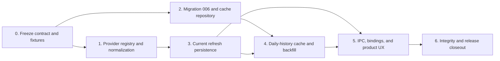

# v0.1.6 Implementation Plan

## Execution Contract

This plan implements the [v0.1.6 release contract](v0.1.6.md) and [technical design](v0.1.6-technical-design.md) from the schema-005 baseline recorded in [v0.1.6 compatibility baseline](v0.1.6-baseline.md).

**Status:** `Implementation complete — Phase 6 automated and isolated-bootstrap evidence recorded; interactive and distribution gates pending`. Execute phases in order. A phase is not complete until its domain, persistence, network boundary, generated IPC, frontend, locale, accessibility, migration, history, analytics, compatibility, and exit checks are proven. Do not claim an external Yahoo endpoint is available from a green fixture-only test.

Do not run Tauri development, schema migration, history rebuild, or release packaging against the only copy of real financial data. Use committed sanitized fixtures and isolated application-data paths.

## Dependency Flow

## Phase 0 — Contract, Baseline, and Provider Fixtures

### Deliverables

- Approve the four v0.1.6 documents and freeze `yahoo_finance`, endpoint scope, provider routing, daily-close-only storage, 3,660-day bound, coverage semantics, and no-background-work policy.
- Reverify the schema-005 baseline: migrations, 118-command allowlist, capability/CSP assertions, quote and history selection, dirty rebuild, manual fallback, backup/restore, and analytics goldens.
- Add sanitized recorded Yahoo chart fixtures for current price, fallback close, historical gaps/null closes, crypto/ETF/index symbols, FX, invalid cardinality, array mismatch, currency mismatch, malformed decimal, HTTP 429, timeout, oversized body, unknown symbol, and provider correction at the same timestamp.
- Select and pin the direct native HTTP dependency, TLS feature, URL builder, body-size strategy, and test transport without enabling frontend HTTP or a broad Tauri capability. Confirm the chosen TLS feature builds and notarizes cleanly for an arm64 macOS bundle before relying on it in later phases; a dependency that breaks signing/notarization must be reselected here, not discovered in Phase 6.
- Record isolated current/history expected values and cache intervals in a v0.1.6 golden fixture.

### Exit checks

- No open decision can change provider source identity, daily timestamp semantics, quote provenance, coverage write atomicity, dirty invalidation, or automatic-refresh prohibition.
- Fixtures include no user symbols, account IDs, prices, balances, paths, credentials, or raw production response body beyond synthetic values.
- Existing `bun run check` and `git diff --check` pass before feature work begins.

## Phase 1 — Provider Registry and Yahoo Normalization

### Deliverables

- Replace production-unconfigured split adapters with an injected `MarketDataRegistry` and a capability DTO; retain deterministic fakes through the same interface.
- Implement strict ProviderId routing, typed Instrument/FX request identities, validated normalized current/daily results, and optional search capability.
- Implement `YahooChartProvider` with fixed HTTPS host, safe URL path encoding, no redirect, timeout, request semaphore, content caps, status mapping, and payload normalization.
- Parse current `regularMarketPrice`/`regularMarketTime`, then last valid aligned close fallback; parse daily aligned timestamp/close arrays only.
- Reject currency mismatch, invalid result cardinality, missing fields, non-finite/non-canonical decimal, invalid timestamp, invalid positive FX rate, wrong direct pair, and oversized content without a write.

### Required tests

- Every symbol form in the release contract is encoded as one path segment and never changes the fixed host/path shape.
- Current quote primary/fallback precedence, timestamp choice, delayed state, currency checks, FX direct orientation, and decimal parsing are exact.
- Null daily close is skipped; malformed non-null close and all alignment/result errors fail safely.
- 429 stops a bulk operation's later Yahoo requests; timeout/transport/auth/unsupported/malformed results map to stable errors; no default test uses the network.
- Registry behavior for absent adapters and Yahoo's unsupported search is deterministic.

### Exit checks

- Domain, valuation, history, IPC DTOs, and frontend contain no Yahoo field name or URL.
- No financial value uses `f32` or `f64`; no error/log exposes URL, symbol, raw body, price, rate, or provider header.
- Rust tests, formatting, and Clippy pass.

## Phase 2 — Migration 006 and Coverage Repository

### Deliverables

- Add schema-only `006_market_data.sql` with `market_data_daily_coverage`, target-shape checks, canonical FX pair checks, FK/indexes, and no trigger or initializer writes.
- Implement bounded repository reads and deterministic interval subtraction/merge for target/provider coverage; the merge step re-reads current coverage inside the same write transaction that inserts new quotes, immediately before computing the union, so a concurrent commit is never silently overwritten.
- Preserve existing source keys and manual/provider quote selection; add no multi-provider settings table.
- Update migration, future-schema, backup/restore, canonical-export, and fixture baselines for schema 006.

### Required tests

- Schema-005 fixture migration creates no quote, coverage, Activity, preference, snapshot, or network request and preserves current/historical/analytics goldens.
- Wrong target shape, reversed/non-canonical FX pair, reversed dates, illegal provider key, and cross-Household reference write nothing.
- Adjacent/overlapping coverage merges deterministically; disjoint ranges remain separate; subtraction returns ordered bounded gaps.
- Backup/Restore preserves coverage, whereas existing canonical/manual CSV boundaries exclude provider cache data.
- Two concurrent backfill requests for the same target and provider both commit; neither loses the other's coverage range, and no committed quote or coverage row is overwritten.

### Exit checks

- Cache metadata alone cannot be selected as a price/rate or affect valuation.
- Future schema `007` remains blocked before migration, cache write, provider request, or ordinary command write.

## Phase 3 — Current Refresh and Quote Persistence

### Deliverables

- Route existing refresh commands through the registry and use `source_key = yahoo_finance` for production observations.
- Validate target eligibility, provider binding, archive status, selected preference, required FX pairs, direct orientation, and quote currency before persistence.
- Create a shared provider append path that deduplicates exact observations, appends corrections, and calls existing dirty invalidation inside the quote transaction.
- Preserve deterministic partial-success order and change result DTOs compatibly to report `fetched`, `cached`, `skipped`, `failed`, or `rate_limited`.

### Required tests

- Manual-selected, unbound, archived, wrong-household, duplicate, and unsupported targets do not make an HTTP request or mutate local data.
- Exact re-fetch writes no duplicate; corrected value at same timestamp appends and wins deterministic selection.
- Each provider Instrument/FX insertion marks dirty from `quoted_at`; a failure rolls back its target only and does not alter preferences.
- Current Overview/Portfolio/Account values use persisted quotes after refresh but their ordinary reads make zero provider calls.
- Existing manual refresh and partial-failure goldens remain valid after result DTO extension.

### Exit checks

- Refresh cannot write an Activity, account/holding projection, snapshot revision, declaration, or preference.
- Rate-limit stop and two-request concurrency are independently proven.

## Phase 4 — Daily History, Coverage, and Historical Integrity

### Deliverables

- Add bounded backfill service operations for one Instrument, required FX, and all eligible targets.
- Validate inclusive History-Origin-local ranges, derive uncovered intervals, fetch those intervals, normalize daily closes, and persist observations plus coverage atomically per target.
- Support explicit force fetch; validate and preserve zero-bar successful market-closed coverage.
- Reuse the existing rebuild UI/service only after emitting its ordinary dirty state; do not automatically rebuild.

### Required tests

- Date bound, origin/last-closed boundary, DST/local-date conversion, 3,660-day maximum, exact interval subtraction, force behavior, and empty coverage behavior are correct.
- A valid response commits its bars, merged coverage, and earliest dirty marker once; malformed/persistence failure commits none of those facts.
- Re-running a covered range makes no provider request. A correction appends a quote rather than rewriting history.
- Historical valuation and snapshot rebuild select only quotes at or before each cutoff; backfilled Instrument and direct/inverse FX data repair availability without future leakage.
- Gain, return, Benchmark comparison, currency decomposition, and attribution goldens remain byte-identical except for intentionally rebuilt quote-dependent snapshots.

### Exit checks

- Daily history persists close only; no OHLCV, intraday data, chart endpoint DTO, or frontend financial computation is added.
- Snapshot updates occur only through the existing explicit, bounded closed-day rebuild contract.

## Phase 5 — IPC, Bindings, and Product Experience

### Deliverables

- Add market-data capability and history-backfill IPC commands in `ipc.rs`, generated bindings, operation-gate/capability audits, command error mapping, and locale keys.
- Enable valid Yahoo identity and explicit Provider preference in Instrument management; keep manual input complete and preserve unsaved form input on failure.
- Add single-target and bulk current/history actions, bounded range dialog, cache/partial/error states, progress, retry, source provenance, and query invalidation.
- Keep the frontend CSP/capabilities unchanged; update UI tests, keyboard navigation, semantic status output, and locale parity.

### Required tests

- Provider controls appear only when capability and complete binding permit them; no Yahoo search control is displayed.
- Refresh/backfill need an explicit click, prevent duplicate submit, preserve form input, show cache/partial/rate-limit failure, and invalidate only relevant Rust-backed queries.
- The frontend performs no network request, decimal arithmetic, cache-gap calculation, or snapshot rebuild.
- Keyboard-only and screen-reader status behavior works for form, range dialog, progress, result list, and errors in both locales.

### Exit checks

- Generated bindings and command registry are in sync; all ordinary commands still take shared permits and no broad permission is granted.
- A production UI boot, route mount, and focus change make zero provider requests.

## Phase 6 — Integrity, Documentation, and Release Closeout

### Deliverables

- Update architecture/domain/data-IPC docs only where implemented stable contracts supersede v0.1.2's unconfigured provider note; update roadmap and release status honestly.
- Run migration and future-schema matrices, quote/history/analytics/backup compatibility tests, provider fixture tests, locale/a11y checks, generated-binding drift, `git diff --check`, and full `bun run check`.
- Perform an isolated-data manual smoke: Manual quote offline, Yahoo current Instrument, Yahoo current FX, cached daily history, malformed response, 429 partial result, dirty-state visibility, explicit rebuild, and restore of a backup containing provider cache.
- Build arm64 artifacts, verify version, signing/notarization policy, and release evidence without claiming an unperformed external publication.

### Exit checks

- No real financial database is the only copy involved in migration, backfill, rebuild, backup, restore, or release smoke.
- The precise artifact, validation environment, Yahoo adapter limitation, privacy implication, and remaining distribution gates are documented.
- No release tag, publication, or claim of Yahoo availability is made before it actually occurs.
- The Phase 0 HTTP/TLS dependency choice still builds, signs, and notarizes cleanly in the arm64 artifact; no new dependency silently changed the signing/notarization outcome since Phase 0.

## Phase Status Table

| Phase | Status | Completion evidence |
| --- | --- | --- |
| 0. Contract and fixtures | Implemented | Baseline checks: 158 frontend tests and 496 Rust tests; sanitized fixtures; pinned reqwest 0.13.4 with rustls; `git diff --check` |
| 1. Registry and normalization | Implemented | `MarketDataRegistry`, injected Yahoo/fake providers, bounded Rust HTTP client, fixture-only normalization tests, 501 Rust tests, Clippy |
| 2. Migration and cache | Implemented | Schema 006 coverage table, bounded merge/subtraction repository, schema fingerprints, schema-007 future guard, 504 Rust tests |
| 3. Current refresh | Implemented | Transactional provider append/dedup, dirty-state and eligibility checks, five-state partial results, 2-request concurrency and rate-limit-stop tests; 508 Rust tests and IPC binding check |
| 4. Daily history | Implemented | Bounded local-date backfill, DST UTC envelopes, coverage gap/force semantics, atomic daily quote+coverage persistence, zero-bar/correction/rollback/direct-FX tests; 512 Rust tests and IPC drift check |
| 5. Product experience | Implemented | Capability DTO and gated search, shared-gate history IPC, generated bindings, provider binding form, explicit current refresh/backfill controls, confirmation/retry/partial-result UI, paired locales, 160 frontend tests, 512 Rust tests, Clippy and IPC drift check |
| 6. Closeout | Automated and isolated-bootstrap evidence recorded; interactive/distribution pending | Version 0.1.6 synchronized; architecture, roadmap, release, compatibility, and evidence docs updated; full `bun run check`, `git diff --check`, and `hdiutil verify` passed; arm64 `.app`/`.dmg` build succeeded at `target/aarch64-apple-darwin/release/bundle/`; isolated schema-006 bootstrap passed; interactive GUI smoke, Developer ID signing/notarization, and publication remain pending |

## Agent Handoff Rules

- Treat this plan as a contract, not implementation evidence. Current code, migrations, generated bindings, and tests override it if they disagree.
- Keep provider adapters out of domain and valuation code. All Tauri commands remain in `ipc.rs`; commands never access SQLx directly.
- Use `rust_decimal` strings across IPC. Never parse a quote/rate into a JavaScript number or write a floating-point fixture.
- Preserve append-only quotes; coverage is the only mutable market-data cache. Do not use `INSERT OR REPLACE` for quote facts.
- Insert a provider quote, dirty marker, and successful coverage in the same target transaction, re-reading current coverage inside that transaction immediately before merging (the shared `OperationGate` allows concurrent ordinary commands, so a pre-fetch coverage read must never be trusted at commit time). Do not mark coverage after an error or make snapshot rebuild an implicit refresh side effect.
- Keep frontend HTTP/CSP/capabilities closed. Test live Yahoo only as an opt-in manual diagnostic, never as a default gate or release proof.
