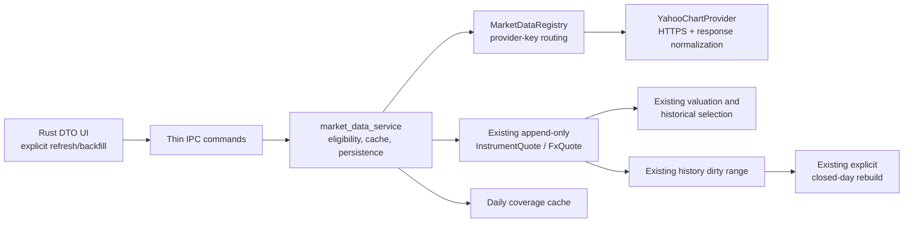

# v0.1.6 Technical Design

## Design Boundary

This design enables one user-initiated market-data capability without changing financial authority. It extends existing `InstrumentQuote`, `FxQuote`, `QuoteSourceKind`, `provider_key`, `provider_symbol`, `refresh_service`, quote preference observations, History Origin, and snapshot invalidation. It does not introduce a second price model, a provider-shaped domain DTO, or frontend network access.

The production adapter is a temporary Yahoo Finance chart endpoint integration. It is intentionally isolated in infrastructure code. Its protocol can change, or it can be removed, without requiring schema or valuation changes.

## Architecture



The frontend calls only Rust IPC. The service obtains no provider data inside Overview, Portfolio, Accounts, history, analytics, bootstrap, search, Maintenance listing, route mount, or startup. A successful provider request becomes ordinary persisted quote data before any financial read can use it.

## Provider Abstraction

### Stable Application Types

`application::market_data` owns neutral request/result types. `domain`, valuation, history, and TypeScript must not import a concrete adapter.

```text
ProviderId                 // validated closed registry key, e.g. "yahoo_finance"
MarketDataCapabilities     // latestInstrument, latestFx, dailyHistory, instrumentSearch
InstrumentMarketIdentity   // providerId + providerSymbol + expected CurrencyCode
FxMarketIdentity           // providerId + direct base CurrencyCode + quote CurrencyCode
LatestInstrumentQuote      // UnitPrice, CurrencyCode, Timestamp, delayed
LatestFxQuote              // FxRate, direct currencies, Timestamp, delayed
DailyClose                 // Timestamp, UnitPrice or FxRate; no f64
DailyHistoryRequest        // direct identity + inclusive timestamp window
```

`MarketDataProvider` exposes capability discovery plus normalized async operations:

```text
fetch_latest_instrument(identity) -> LatestInstrumentQuote
fetch_latest_fx(identity)         -> LatestFxQuote
fetch_daily_instrument(request)   -> Vec<DailyClose<UnitPrice>>
fetch_daily_fx(request)           -> Vec<DailyClose<FxRate>>
search_instruments(query)         -> optional capability, unsupported by Yahoo v0.1.6
```

The trait may use a boxed future or a pinned `async-trait` implementation, but adapters must be dependency-injected behind an `Arc<dyn MarketDataProvider>`. `MarketDataRegistry` owns `ProviderId -> adapter` routing and is constructed by `AppState`; tests install deterministic fake adapters. The old split `QuoteAdapter` / `FxAdapter` and their fake types are migrated behind this registry rather than retained as a parallel live path.

An Instrument routes through its existing `(provider_key, provider_symbol)`. v0.1.6 validates new or updated Provider bindings against the registry and accepts exactly `yahoo_finance` for production. Required FX pairs route through the registry's compiled default ProviderId, also `yahoo_finance`. That keeps the existing Manual/Provider preference schema intact. Adding a second compiled adapter later requires registration and routing policy work, but no quote-table, valuation, or history rewrite.

### Yahoo Chart Adapter

The adapter owns the only Yahoo-specific route:

```text
GET https://query1.finance.yahoo.com/v8/finance/chart/{url_encoded_symbol}
    ?range=1m&interval=1d                 // current
GET https://query1.finance.yahoo.com/v8/finance/chart/{url_encoded_symbol}
    ?period1={unix_seconds}&period2={unix_seconds}&interval=1d
                                                // bounded daily history
```

`{url_encoded_symbol}` is built by a URL library as one path segment, never interpolated into a URL string. Instrument symbols are supplied as metadata; FX symbols are created only as `{FROM}{TO}=X`. The adapter always uses HTTPS and the fixed host. It sends no cookie, credential, account, holding, quantity, balance, or user-identifying financial field.

For current quotes it requires exactly one `chart.result` item. It parses:

1. `meta.regularMarketPrice` and `meta.regularMarketTime` when both are valid;
2. otherwise, the last index with a finite valid `close` and aligned `timestamp`;
3. `meta.currency`, which must agree with the request's expected currency.

The regular-market path returns `delayed = false`. The close fallback returns `delayed = true`; it is a known daily close rather than a claimed real-time value. Missing price or timestamp, a non-single result, an API error object, mismatched currency, a non-finite numeric lexeme, invalid decimal scale, or invalid timestamp is a normalized safe error with no write.

For daily history it validates the same result envelope and the aligned `timestamp` and `close` arrays. `null` close entries are legitimate absent bars and are omitted. Any non-null invalid value, out-of-window timestamp, array-length mismatch, response beyond configured byte limits, or duplicate conflicting item in one response fails the target with no coverage write. The adapter returns only normalized daily closes; it does not leak `meta`, OHLCV arrays, response JSON, URL, or HTTP headers.

`serde_json::Number::to_string()` is parsed directly by Nestworth decimal parsers. The adapter never deserializes a price or rate through `f32` or `f64`. Unit price continues to follow `UnitPrice`; FX rate continues to follow positive `FxRate`.

### HTTP, Limits, and Failure Mapping

The direct HTTP client is Rust-owned with a fixed eight-second per-request timeout, redirects disabled, response content-length precheck, and a streaming body cap of 2 MiB for current and 8 MiB for daily history. The final dependency and TLS feature are locked in Phase 0; it must be a direct, pinned `reqwest` dependency with default features disabled and a reviewed TLS feature.

The global Yahoo request semaphore is two. A bulk operation processes targets in deterministic key order. HTTP 429 maps to `PROVIDER_RATE_LIMIT`, trips an operation-local stop flag, and leaves later targets as not started due to rate limit. There is no automatic retry, exponential retry loop, or background queue. Timeout and transport/5xx errors map to `PROVIDER_UNAVAILABLE`; 401/403 to `PROVIDER_AUTHENTICATION`; a chart-level unknown symbol or validated 404 to `UNSUPPORTED_PROVIDER_SYMBOL`; parse/contract failures to `MALFORMED_PROVIDER_RESPONSE`.

Errors and tracing expose a stable code, operation kind, target count, cache count, success count, failure count, and duration only. They never expose request URLs, symbols, headers, response bodies, prices, rates, IDs, or financial context.

## Quote Persistence and Cache

### Existing Quote Facts

Provider results persist through shared quote-service constructors, with:

```text
source_kind = provider
source_key  = yahoo_finance
```

The append path validates Instrument Household ownership, current non-archive eligibility, configured quote currency, the direct FX orientation, and all domain decimal and timestamp constraints. It does not call a manual append function, and therefore it does not alter a preference.

For an incoming provider observation, the transaction finds an existing row with the same target, `source_kind`, `source_key`, `quoted_at`, currency/direction, value, and delayed flag. An exact match is a cache no-op. A different valid value at the same timestamp appends a new quote with a newer `created_at`; existing `(quoted_at, created_at, id)` selection then deterministically chooses the correction. Quotes are never updated or deleted.

Every inserted quote calls `activity_service::mark_dirty_for_household` inside the same transaction using `quoted_at`. This closes the current provider-refresh gap: a provider quote must invalidate history just as a manual or imported quote does. A same-day current quote may make today dirty but does not cause automatic rebuild; closed-day rebuild rules continue to control actual snapshot writes.

### Migration 006

Migration `006_market_data.sql` adds only mutable cache metadata:

```text
market_data_daily_coverage
  id
  household_id
  provider_key
  target_kind                 // instrument | fx
  instrument_id               // only for instrument
  currency_a, currency_b      // canonical a < b, only for fx
  start_local_date
  end_local_date              // inclusive, start <= end
  updated_at
```

It has Household/Instrument foreign keys, target-shape and normalized-pair checks, a target/range lookup index, and no trigger. Rust owns interval non-overlap and merge semantics. The migration creates no provider binding, quote, coverage, Activity, snapshot, preference, or network request. It preserves every schema-005 quote and source key.

Coverage is non-financial cache metadata. Successful history persistence loads intersecting and adjacent coverage rows for the target and provider, replaces them with the deterministic merged union, and commits it with new quotes and dirty marking. If a response is invalid or persistence fails, neither its coverage nor any of its quotes commits. A successful zero-bar response covers the requested range because the provider has authoritatively returned no daily close there.
The gap calculation that selects which subranges to request may read coverage before the network call, since the shared `OperationGate` permits multiple ordinary commands to run concurrently and a backfill is not exclusive. To prevent a lost update between two concurrent backfills of the same target, the commit step re-reads the target's current coverage rows inside the same write transaction that inserts the new quotes, immediately before computing and writing the merged union, and commits both together. A transaction that finds coverage already extended by a concurrent commit merges against that fresher state rather than the pre-fetch snapshot; it never overwrites a concurrently committed range with a stale union.

The coverage key uses the effective provider key. Instrument coverage is per Instrument; FX coverage is per Household, provider, and normalized pair. It does not change quote-source preference or make a pair eligible. Backup/Restore preserves coverage because it preserves the full database. Canonical JSON and current manual CSV formats continue to exclude provider cache data; provider rows and coverage do not become user-authored interchange facts.

### History Range Semantics

IPC accepts `start_local_date` and `end_local_date` in the immutable History Origin timezone. The service rejects a missing/unconfirmed origin, `start > end`, dates before origin, end dates after the last closed local day, and a range longer than 3,660 days. It converts this inclusive local range to an exact UTC request envelope, filters returned provider timestamps back to that window, and records coverage in the same local-date vocabulary.

The service subtracts the merged coverage union from a non-forced range and makes no request when no gap remains. A `force` request ignores coverage for its bounded range but retains the merged coverage after a successful response. It never contacts the provider to fill today through a daily history query. Current refresh is intentionally separate and may request Yahoo every time the user explicitly invokes it.

## Service and IPC Contract

Existing current-refresh commands retain their names and add stable no-op/cached semantics:

```text
search_provider_instruments       // capability-gated; Yahoo returns unsupported
refresh_instrument
refresh_required_fx
refresh_all
```

Add these commands, all thin wrappers in `ipc.rs` and all protected by the shared operation gate:

```text
get_market_data_capabilities() -> MarketDataCapabilitiesDto
backfill_instrument_history(BackfillInstrumentHistoryInput) -> MarketDataRefreshResultDto
backfill_required_fx_history(BackfillHistoryRangeInput) -> MarketDataRefreshResultDto
backfill_all_history(BackfillHistoryRangeInput) -> MarketDataRefreshResultDto
```

`BackfillInstrumentHistoryInput` contains `instrument_id`, `start_local_date`, `end_local_date`, and `force`; the FX/all form contains the range and `force`. Result items include a safe key, `status` (`fetched`, `cached`, `skipped`, `failed`, `rate_limited`), inserted count, deduplicated count, coverage start/end when applicable, and stable error code. It contains no raw provider detail or financial amount.

Current refresh returns the same result shape after compatibility migration. For it, `fetched` means an observation was inserted and `cached` means the provider returned an exact already-persisted observation. Existing frontends may continue to consume `ok`; v0.1.6 adds status fields rather than treating a cache hit as failure.

Add stable errors only where the current vocabulary is insufficient:

```text
MARKET_DATA_UNSUPPORTED
MARKET_DATA_HISTORY_INVALID_RANGE
MARKET_DATA_HISTORY_UNAVAILABLE
MARKET_DATA_RESPONSE_TOO_LARGE
```

Existing `PROVIDER_RATE_LIMIT`, `PROVIDER_UNAVAILABLE`, `PROVIDER_AUTHENTICATION`, `UNSUPPORTED_PROVIDER_SYMBOL`, `MALFORMED_PROVIDER_RESPONSE`, `INVALID_UNIT_PRICE`, `INVALID_FX_RATE`, and `DECIMAL_OVERFLOW` remain the detailed causes. Command errors remain safe localized category messages.

## Frontend Contract

The Instrument form presents a source selector only after `get_market_data_capabilities` establishes a usable provider. Selecting Yahoo shows a labelled market-symbol input with examples, a statement that symbol lookup is not available, and a visible statement that Yahoo is an unofficial, unaffiliated data source that may change or become unavailable without notice. Submitting validates both identity fields, preserves input on failure, and does not select Provider until the complete valid binding is saved.

Instrument detail displays selected source, provider name, symbol, last quote time, freshness, and a keyboard-accessible **Refresh current price** action. A separate **Backfill daily history** dialog requires inclusive start and end dates, shows the 3,660-day maximum, defaults to a safe range ending on the last closed date, and offers a clearly labelled force re-fetch only after normal cache status is visible.

The existing FX management surface gains matching current refresh and daily backfill controls for required Provider pairs. The Market Data bulk action is explicit, confirms broad historical backfill, reports aggregate and per-target progress, allows retry of failed targets, and never fires on mount. Query invalidation refreshes quote history, valuation, Portfolio, Overview, Maintenance, history-rebuild status, and relevant Analytics reads only after a successful command result.

The UI renders Rust decimal strings only with existing formatters; it performs no price, FX, cache-gap, freshness, or financial calculation. It uses semantic status text in addition to color, disables duplicate submits, announces progress and partial completion, and keeps English/Simplified Chinese keys exactly paired.

## Security and Privacy

- The native HTTP client is the only new network surface. CSP remains `self`/IPC only and the frontend receives no HTTP, shell, filesystem, opener, or clipboard capability.
- The fixed Yahoo host, HTTPS scheme, encoded path segment, disabled redirects, size cap, timeout, and strict response schema prevent the provider from turning into an arbitrary fetch proxy.
- Provider values are untrusted until validated by existing decimal, currency, timestamp, ownership, and archive rules. Invalid input writes nothing.
- No secret is required or stored. The product never represents Yahoo as a private account integration.
- Startup, bootstrapping, background work, and passive reads make no external request. Provider use leaks only the voluntarily configured instrument symbol or necessary FX pair to the selected endpoint.
- Full backups contain cached provider rows as part of the database and retain their normal privacy warning. Canonical/CSV export boundaries remain manual-data-oriented and do not silently turn provider cache into a portable user assertion.

## Design Invariants Checklist

- No Yahoo-specific structure leaves its adapter.
- No financial value crosses a binary floating-point boundary.
- No provider response writes a quote unless all target validation succeeds.
- No failed history request records coverage.
- No Manual preference or quote is changed by provider refresh.
- No quote after a historical cutoff is selected for that cutoff.
- No provider write bypasses history dirty invalidation.
- No read path or automatic lifecycle event contacts a provider.
- No Provider error blocks startup or replaces local data.
- Two concurrent backfills of the same target merge coverage without silently dropping a concurrently committed range.
